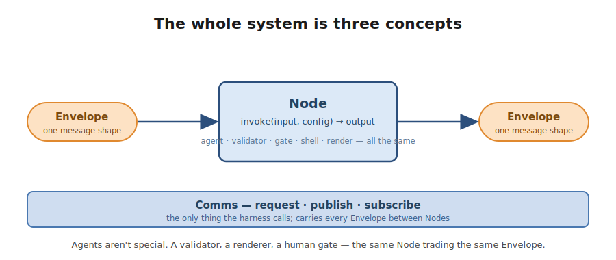
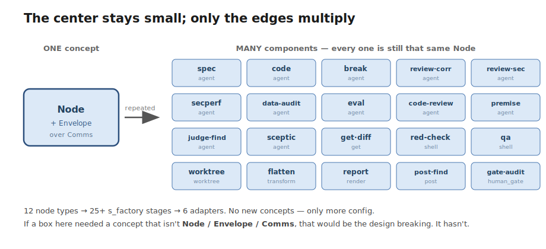
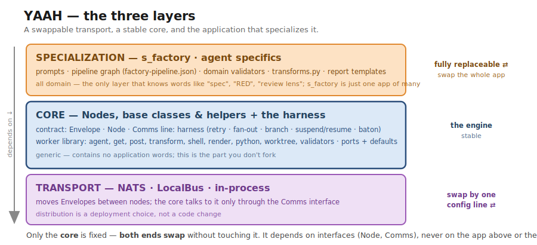
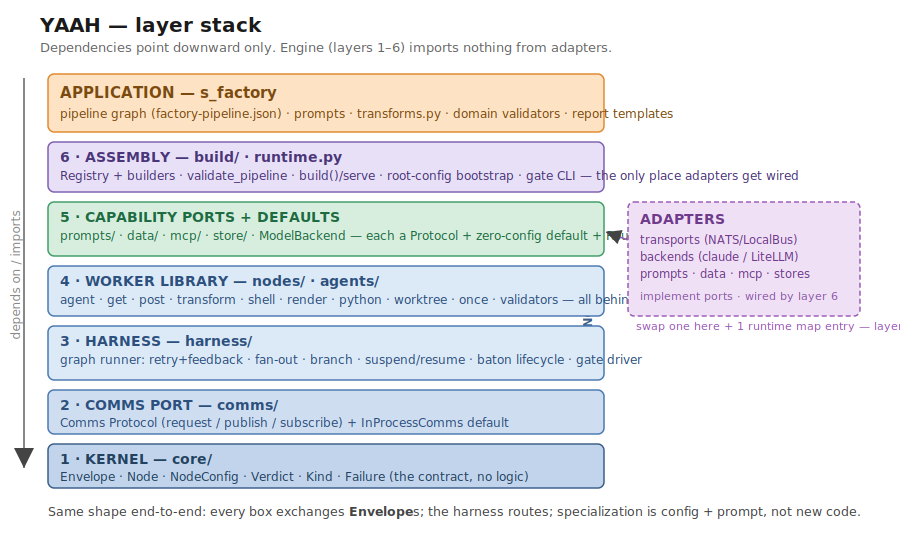
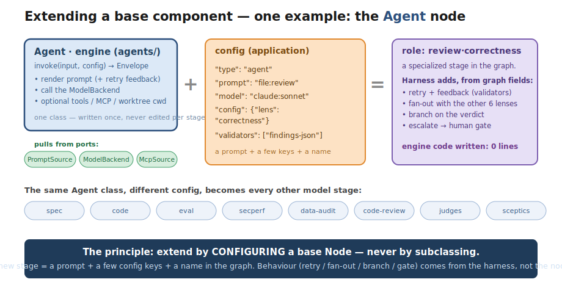

# YAAH — Architecture

The **structural** map of YAAH: the layers, what each is responsible for, its main
components, and how the generic engine nodes become an application's specialized
stages. For the **rationale** behind these choices (workers-not-citizens, the three
comms modes, suspend/resume, deferred features) see [`design.md`](design.md); for
**build state** see [`TODO.md`](TODO.md).

One sentence to hold onto: **everything is a `Node` exchanging `Envelope`s over
`Comms`; the harness routes; specialization is config + prompt, not new code.**

---

## 0. The core, in one picture

The whole system is three concepts. Read this first — everything below is these
three, repeated.



The specialized level *does* have many components (a dozen node types, a half-dozen
adapters, 25+ the example app stages). But none of them is a **new concept** — each is the
same `Node` trading the same `Envelope`. Complexity lives at the edges; the centre
stays small and fixed.



That invariant is the design's load-bearing claim: *if any box ever needed a concept
that isn't `Node` / `Envelope` / `Comms`, the abstraction would be leaking.* So far it
hasn't — which is why the system fits in your head despite the component count.

---

## 1. The layers

**Zoomed out, it's three layers — a fixed core with both ends swappable.** Only the
core is invariant; the application on top and the transport below are each fully
replaceable without touching it:



- **Specialization** (top — fully replaceable) — the example app: prompts, the pipeline
  graph, domain validators, transforms, templates. It's *all* domain; the example app is
  just one app of many. Swap the whole layer for a different application and the core
  doesn't change (the `app → yaah` one-way dependency, design.md §10).
- **Core** (middle — the only fixed part) — Nodes, base classes & helpers, the ports,
  and the harness. Generic and stable; contains no application words. The part you
  build *on*, not fork.
- **Transport** (bottom — fully replaceable) — NATS / LocalBus / in-process. The core
  only ever calls the `Comms` interface, so changing transport is a config line, not
  a code change.

The core holds because it depends only on **interfaces** (`Node`, `Comms`), never on
the app above or the transport below — so both ends move independently.

**Zoomed in, the core fans into the detailed stack below.** Dependencies point
downward only; the engine (layers 1–6) imports nothing from adapters:




Bottom = most invariant, depended on by everything above. **Dependencies point
downward only.** The dashed line is the engine↔adapters boundary (§2 of design.md);
the application sits entirely above the engine.

```
┌─────────────────────────────────────────────────────────────────────┐
│  APPLICATION   the example app  (its configs + source)     │  domain
│  pipeline graph (the app's pipeline config) · prompts · transforms.py ·   │
│  domain validators (critical_check) · report templates                │
└───────────────────────────────┬─────────────────────────────────────┘
                                 │ depends on  (never the reverse)
╔════════════════════════════════▼════════════════════════════════════╗
║ 6. ASSEMBLY        build/ · runtime.py · runtime_factories.py         ║  wiring
║    Registry + builders, validate_pipeline, build()/serve_from_config, ║
║    root-config bootstrap, gate CLI. The ONLY place adapters get wired.║
╠══════════════════════════════════════════════════════════════════════╣
║ 5. CAPABILITY PORTS + DEFAULTS                                        ║  pluggable
║    prompts/ · data/ · mcp/ · store/ · ApiProvider (in agents/)        ║
║    each = a Protocol + zero-config default + a Routing `source:key`   ║
╠══════════════════════════════════════════════════════════════════════╣
║ 4. WORKER LIBRARY  nodes/ · agents/                                   ║  the work
║    generic Node implementations, all behind one interface            ║
╠══════════════════════════════════════════════════════════════════════╣
║ 3. HARNESS         harness/                                           ║  the line
║    graph runner: retry+feedback, branch, suspend/resume, baton        ║
║    lifecycle, gate driver. Parallel path in ForkCoordinator;          ║
║    stage-span projection in SpanEmitter                               ║
╠══════════════════════════════════════════════════════════════════════╣
║ 2. COMMS PORT      comms/                                             ║  transport
║    Comms Protocol + InProcessComms default + Subscription            ║
╠══════════════════════════════════════════════════════════════════════╣
║ 1. KERNEL          core/                                              ║  contract
║    Envelope · Node · NodeConfig · Verdict · Kind · Failure           ║
╚══════════════════════════════════════════════════════════════════════╝
            ▲ engine (above) imports nothing from adapters (below)
- - - - - - - - - - - - - - - - - - - - - - - - - - - - - - - - - - - - -
  ADAPTERS   adapters/{transports,backends,prompts,data,mcp,stores}/
  outside-system bindings: NATS/LocalBus · claude/LiteLLM · file/http/
  langfuse · file/git · file mcp · file store. Import the engine ports;
  selected by config; wired only by layer 6.
```

Adapters are drawn at the bottom because they're the *replaceable* edge, but in
dependency terms they sit beside layer 5: they **implement** the ports and are
imported only by layer 6. Nothing in layers 1–5 imports `adapters/`.

---

## 2. Layers in detail

### 1. Kernel — `core/`
The contract. No logic, no I/O; pure data shapes everything else agrees on.

| Component | Responsibility |
|---|---|
| `Envelope` | the one message shape — `id`/`kind`/`payload`/`headers`, `reply()` chaining, JSON wire format |
| `Node` (Protocol) | `invoke(input, config) -> Envelope` — every worker |
| `NodeConfig` | per-node settings (model, effort, temperature, timeout, retries, idempotency_key, extras) |
| `Verdict` / `Failure` | a validator's pass/fail + failures, with `hard`/`soft` severity |
| `Kind` | reserved structural kinds: `task`/`result`/`verdict`/`await`/`handoff`/`resume`/`event`/`error` |

### 2. Comms port — `comms/`
The boundary the harness talks through; the only way envelopes move.

| Component | Responsibility |
|---|---|
| `Comms` (Protocol, `comms.py`) | `request` (call), `publish` (event), `subscribe` |
| `InProcessComms` (`in_process_comms.py`) | zero-infra default — nodes held in-process, routed by exact role name |
| `Subscription` (Protocol, `subscription.py`) | a cancel handle for event-mode delivery; transports return one from `subscribe` so the caller can tear down without knowing the impl |

### 3. Harness — `harness/`
The line. Drives one run through the graph using only `Comms` + `Node` — ignorant
of what any node does or which transport carries it.

| Component | Responsibility |
|---|---|
| `Harness` | the run loop: per-stage validator **retry-with-feedback**, conditional **branch**, baton handover, **suspend/resume** around gates. Owns the *linear* path (stage → attempts → retry / escalate / handover) and delegates parallel + cross-cutting concerns to the two helpers below |
| `ForkCoordinator` | owns the parallel path: spread an envelope to N branch stages, optionally wait for a fan-in `clear`, reduce, continue (`run_collect(stage, input) → Envelope`). Same semantics as before, separated so each shape reads as one idea |
| `SpanEmitter` | projects (stage, result, time) into a `Span`; one source of truth for the stage-span shape (status mapping ok/suspended/cleared/error, attrs, clock/parent/corr). Composition, not inheritance — `harness._spans.stage(…)` / `.error(…)` |
| `Graph` / `Stage` | the pipeline shape — stages (node, validators, max_attempts, feedback, escalate, then, fanout, fork, branch) + a start |
| `Baton` / `BatonStore` | the unit of ownership and resume cursor; bounded lifecycle (evict on terminal outcome + TTL sweep); persisted for cross-process resume |
| `drive()` (gate_driver) | policy *on top of* the line — loops `run → resume` to completion, asking an **injected decider** at each gate (decision source stays out of the harness) |
| `Done` / `Suspended` / `Cleared` / `StageFailed` | typed outcomes (Suspended carries `awaiting` + soft `concerns`; Cleared = a `clearable` stage cancelled in-flight by a matching clear) |

### 4. Worker library — `nodes/`, `agents/`
The generic, reusable units of work — every one a `Node`. This is the catalogue the
application draws from.

| Component | Responsibility |
|---|---|
| `agents/Agent` | the LLM worker — render prompt (inline or from a PromptSource) + feedback, call an `ApiProvider`, return raw output; optional tools + MCP + worktree cwd |
| `agents/` backends + `tool_loop`/`tool` | `ApiProvider` port; `Fake`/`Scripted`/`Routing` defaults; model-initiated tool-call loop |
| `agents/envelope_tool` (R9 `envelope_get`) | built-in tool bound per-invocation: the model PULLS slices from its own envelope under an `expose` allow-list + `max_chars` cap. Lets a slim arm fetch on demand instead of inlining the whole envelope |
| `agents/context_broker_tool` (R12 `context_broker`) | the fuzzy companion to R9: same allow-list, but the agent describes what it needs in NL and a cheap broker NODE (regular yaah agent at `broker_role`) returns the slice. FAST PATH = if `field:` is allow-listed + present, served locally without a model call |
| `agents/manifest` (R11 `tool_manifest`) | renders an agent's `tools` into a deterministic markdown block via `{{tool_manifest}}` so prompts don't hand-write usage. With a turn-capable backend, the SAME Tool spec feeds `to_function_schema()` — one source of truth |
| `filters/Filter` (R10) + `adapters/filters/` | a tiny `async apply(value, **params) -> value` PORT the agent's envelope_get looks up by name. Concrete adapters: `AroundKeywordFilter` (±N lines around a keyword), `RedactFilter` (regex→placeholder, AUTHOR pins patterns so model args can't widen), `CallTargetFilter` (bridges `fn:`/`node:`/`http:` into the port). Wired in pipeline JSON: `filters: {<name>: {type, ...args}}` resolved via `filter_factories.build_filter` |
| `nodes/` get · post · transform | the I/O verbs: **get** (DataSource→payload), **post** (payload→DataSink), **transform** (call `fn:`/`node:`/`http:` → result; `call:"envelope"` = the config-aware specialization that subsumed the old `python` node) |
| `nodes/` shell · shell_check · render · worktree · once | deterministic workers: run a command / assert exit / fill a template / git-worktree isolation / run-effect-once wrapper |
| `validators.py`, `build/human_gate` | generic validators (`json_object`, `expect_field`) and the `human_gate` (returns `await`) |

### 5. Capability ports + defaults — `prompts/`, `data/`, `mcp/`, `store/` (+ `ApiProvider` in `agents/`)
Where a node gets its externalizable inputs. Each layer is the **same pattern**: a
`Protocol` port, an in-memory/static **default**, and a `Routing*` composer that
dispatches a `source:key` string (e.g. `file:eval`, `git:`, `registry:acme-prod`).

| Port | Default | Routes a `source:key` to… |
|---|---|---|
| `PromptSource` (prompts/) | `StaticPromptSource` | a prompt body |
| `DataSource`/`DataSink` (data/) | — | **get**/**post** payloads |
| `McpSource` (mcp/) | `StaticMcpSource` | an agent's MCP server set |
| `StoreBackend` (store/) | `MemoryBackend` | durable baton state + idempotency (`store/idempotency.py`, the `once` node) |
| `ApiProvider` (agents/) | `FakeProvider`/`ScriptedProvider` | a provider via `provider:model` |

### 6. Assembly — `build/`, `runtime.py` (+ `runtime_factories.py`)
Turns config into a wired, running harness. The seam where everything is composed
and the **only** place adapters are imported (in `runtime_factories.py`).

| Component | Responsibility |
|---|---|
| `Registry` + builders | map a node-spec `type` → a constructed `Node`; `default_registry()` lists the built-ins |
| `validate_pipeline()` | fail-fast check that graph targets and node/validator/fanout roles all resolve |
| `build()` / `serve_from_config()` / `harness_from_config()` | in-proc build+register · distributed worker serve · orchestrator-side graph+harness |
| `runtime.py` | root/deployment-config bootstrap: assembly (`_assemble_harness`) + entrypoints (`run_root`/`list_gates`/`resume_gate`, `yaah` console-script + `python -m yaah.runtime` fallback, the gate CLI `--list`/`--resume`/`--clear`) + config-policy (`_resolve_serve` · `_validate_root` (unknown-key guard) · `_validate_root_shapes` (typed-block / named-map / string / bool shape checks with JSON-shaped rewrite suggestions) · `_apply_fake_overlay` (the `--fake` flag — merges the root's `_fake` block over the top level so one root carries both real + fake modes)) |
| `runtime_factories.py` | the config-block→runtime-leaf factories (transport, providers, prompt/data/mcp sources, store, trace sinks) — the 7 type-maps + the generic `_build_router`; the only adapter-import site |

### Adapters — `adapters/`
The specialization toward outside systems; swap or add one here + one runtime
factory-map entry, and nothing in layers 1–6 moves. `transports` (LocalBus,
NatsComms) · `backends` (ClaudeCli, LiteLLM) · `prompts` (file/http/langfuse) ·
`data` (file, git-diff) · `mcp` (file) · `stores` (file) · `trace` sinks (file
JSONL · console · **progress_file** = tailable per-stage lines · **stats_file** =
the rolling aggregate snapshot · langfuse).

---

## 3. Two config inputs

The harness graph and the deployment are separate files (kept apart on purpose):

- **Pipeline config** — *what the stages are*: `nodes` (each a `type` + its config)
  and a `graph` (stages with then/branch/fanout/fork/validators/max_attempts/
  concerns_from/concerns_into; graph-level `sticky` lists payload keys the
  harness re-folds forward when a payload-replacing stage drops them —
  fill-if-missing, the engine-level fix for the dropped-carry-key class;
  graph-level `constraints.precedes` declares `[early, late]` ordering pairs
  the validator enforces structurally — the late stage must be unreachable
  without passing the early one (dominator semantics, loop-tolerant), so
  gate-ordering rules are config, not checklist convention). Portable
  across deployments. (the app's pipeline config.)
- **Root / deployment config** — *what we spin up here*: transport, providers,
  prompt/data/mcp sources, store, which pipeline, which roles this host serves,
  optional input. (`eval.local.json`.) `live_config: true` makes every node
  re-read its MUTABLE leaves (model/knobs/numeric bounds — the
  `validate.MUTABLE_LEAF_KEYS` line, shared with the overlay lint) from the
  pipeline file per invocation, mtime-cached: edit the committed file, the next
  call picks it up, no restart; code-equivalent keys stay constructor-frozen. Same pipeline runs in-proc, local-over-NATS,
  or as a cloud node by changing this file only. A root may carry an inline
  `_fake` block (a `_`-prefixed comment key); the `--fake` CLI flag merges that
  block over the top level at load time, so one root file covers both real and
  testable shapes without the two-file pattern (see `review.claude.local.json`).

---

## 4. How a base node becomes a specialized stage

This is the load-bearing idea and the answer to "how do base nodes map to the
specialized layer": **the application adds almost no new node classes.** It picks a
generic node `type`, hands it a domain **prompt/config**, and names it a **role** in
the graph. One `agent` class becomes ~15 distinct the example app agents purely through
config — no subclassing. (The few genuinely domain-specific Nodes, e.g.
`critical_check`, are registered through the same `Registry`.)

**Worked example — extending the `Agent` node into the `review·correctness` stage:**



```
ENGINE (generic Node type)         specialized by                    the example app STAGE(S) (role + prompt + config)
─────────────────────────────────  ───────────────────────────────  ───────────────────────────────────────────────
agent        render→model→output   prompt + model/effort + tools/    premise-check, spec, spec-grill, code, break,
                                    mcp + cwd_from                    review-{correctness,regression,security,data,
                                                                      observability,spec-drift,i18n}, secperf,
                                                                      data-audit, eval, code-review,
                                                                      judge-{option,refix,findings},
                                                                      *-counterfactual sceptics
json_object  output has required    `required` keys                   spec-check, eval-check
             JSON keys
expect_field payload field == X     `key` / `equals`                  RED gate (tests must fail before code)
shell /      run command /          `command` + `cwd_from` + expect   red-check, qa  (project's own test command,
shell_check  assert exit                                              from app config)
worktree     git worktree add/rm    `repo` + `task_key`               per-task isolated checkout (code/break/qa)
get          DataSource → payload   `source:key` + paths/context      get-diff (`git:` changed lines), file slices
post         payload → DataSink     `sink:key`                        persist findings / artifacts
transform    call fn:/node:/http:   `target` (+ `call:"envelope"`     flatten · dedup · consolidate findings
             default fn(args)→into;  for the config-aware fn          (the app's transforms.py);
             `call:"envelope"` =     (envelope,config)→spread)        A/B + regression recall (recall_node →
             fn(envelope,config),                                     yaah.recall.compare) — proof A/B is a
             spread top-level                                         specialized transform, not a new primitive.
             (subsumed `python`)                                      `call:"envelope"` is the former `python` node.
render       fill {{mustache}}       `template_file` + `out`           render-spec, render-code-review, report (HTML)
human_gate   return `await`         `ask` / `awaiting`                gate:{spec-review,data-audit,cucumber,
                                                                      refix,findings}
once (wrap)  run effect exactly     `idempotent: true`                merge / commit (side-effecting, replay-safe)
             once (needs a store)
```

### Behaviour is specialized by harness *features*, not new code either
The same generic stages get their pipeline behaviour from declarative fields the
**harness** interprets (linear concerns in `Harness`, parallel ones delegated to
`ForkCoordinator`) — no node knows about any of this:

- **validators + max_attempts + feedback** → the retry-with-feedback loop (spec/code re-run with the verdict folded in).
- **fanout: [roles]** → the role BARRIER: run those roles in parallel, merge to `{results, roles}`, continue (review's 7 lenses; the sceptic bank).
- **fork: [stages]** → spread the same envelope to those successor STAGES; each runs as an independent concurrent branch with its own continuation. Branches may end on their own or rejoin at a fan-in. (Explicit key — distinct from `fanout`, the one-stage barrier over ROLES; the two used to share the `fanout` key with the meaning sniffed from the targets, split 2026-06-11.) A fork with a `then` (or a `wait`) is a **synchronized scatter-gather**: it waits for a **`clear`** signal addressed **`<node-id>:<correlation_id>`** (the gate's configurable unique `id`, default the stage name, paired with the run id) over the `clear` topic, then resumes the forking flow carrying that result. The address rides each branch envelope (header `clear_id`, preserved through replies) to the fan-in, which echoes it on the clear. The clear is **sender-agnostic**: the fan-in, a human, a timer, or any party that knows the gate + run may publish it; the fork matches on the address, not the sender (so it works in-proc and cross-process unchanged). Optional `wait: {timeout, on_timeout, clear_topic}` bounds the wait (on timeout: publish to the listener, abandon the branches, proceed). A fork with no `then`/`wait` is terminal — the fan-in's own `then` carries the result (the decoupled a/b/c/d case).
- **fanin: {expect, wait, timeout, on_timeout, reduce}** → a join: wait for the declared branch inputs (`wait` = all / any / n), **reduce** them (default = generic JSON append; override via a `call_target` `reduce`), continue down `then`; on timeout, publish an error to the `on_timeout` listener. Arrivals are parked through the one `EnvelopeStore` (memory default; `state:{type:file}` → durable + inspectable + flushable). The fan-in names the gate(s) it clears via `clears` (else it echoes the fork's own address — the automatic pair).
- **clears: [node-id, …]** → a REUSABLE stage capability (any node, not just a fan-in): on completion, publish a `clear` addressed `<node-id>:<correlation_id>` for each — so a node can release a waiting gate it doesn't sit in front of.
- **clearable: true (agent-clear)** → opt-in; the stage runs INTERRUPTIBLY — its work races a `clear` addressed to its node-id (same three scopes: instance `<node>:<corr>` / node / `*`). A matching clear CANCELS the in-flight task ("stop and remove whatever you are doing") and ends the run as the terminal **`Cleared`** outcome. Sender-agnostic, like every clear. Only safe for reversible work — committed side effects need compensation, not cancel (so it's opt-in, not default).
- **on_error: "clear" | {compensate: T}** → the per-node ERROR-HANDLING alias, run on TERMINAL failure (before `StageFailed` propagates): `"clear"` for a reversible node (publish a clear for it + drop its parked set), `{compensate: T}` for a side-effecting one (run the undo `call_target` T, given `{correlation_id, node, payload, error}`). Recovery cleans up; it does NOT swallow the failure. `clear` stays a dumb signal — this is the smart layer composing clear + store-delete + compensation. Today each failing stage runs only its OWN compensation (the cross-stage saga stack is deferred). `Harness.flush()` drops the durable parked set — the store side of a `*` flush.
- **branch: {on, routes, default}** → pick the next stage from a node's output (judge verdicts; a gate branching on the human decision).
- **escalate: human** → on exhausted retries, return `Suspended` instead of failing; `drive()` + a decider carry it to Done.
- **counterfactual sceptic** = just an `agent` stage that cold-reads a prior stage's *output* (never its reasoning) and emits soft concerns — agent isolation realized as wiring, not a special type.

So the application layer is, in the main, **three artifacts**: a graph (which generic
nodes, wired how), a set of prompts (what each `agent` is), and a little glue python
(`transform` `fn:` callables) — plus its own config (test commands, file paths)
that the engine reads but never hardcodes.

---

## 5. One stage, end to end (worked trace)

A `spec` stage with a JSON validator and a human gate, to see the layers cooperate:

1. **Harness** (3) takes the `spec` stage, calls `comms.request("spec", input)`.
2. **Comms** (2) routes to the `spec` node — an **Agent** (4).
3. The **Agent** fetches its prompt via the **PromptSource** port (5) using
   `prompt: "file:spec"` → the **file adapter** reads it; folds in `payload` +
   any retry `feedback`; calls the **ApiProvider** router (`RoutingProvider`, 5) → the **claude
   adapter** runs `claude -p`. Returns a `result` Envelope.
4. **Harness** runs the stage's validator (`json_object`, layer 4). Soft fails are
   recorded on the baton as `concerns`; a hard fail re-invokes the Agent with the
   verdict as feedback, up to `max_attempts`.
5. On pass, the stage's `escalate: human` gate returns `await` → **Harness**
   persists the **Baton** via the **StoreBackend** port (5) and returns `Suspended`.
6. `drive()` (3) asks the injected decider (config map / stdin / a UI node's
   mailbox) for the decision and calls `resume(baton, decision)` → the run
   continues at the next stage. State survived because the baton is durable.

Assembly (6) built and registered every node from the two config files before any
of this ran; adapters were selected by the root config and are invisible to layers
1–5.

---

## 6. Where to look

| You want… | File(s) |
|---|---|
| the rationale / decisions | [`design.md`](design.md) |
| node-type config keys / output shapes / examples | [`node-reference.md`](node-reference.md) (ground truth: `src/yaah/build/builders.py`) |
| root/deployment config keys + worked examples | [`root-config-reference.md`](root-config-reference.md) (ground truth: `src/yaah/validate.py` + `runtime_factories.py`) |
| the example app mapping in practice | the app's pipeline config + its README |
| agent tools / MCP | [`agent-tools.md`](agent-tools.md) |
| baton / idempotency / memory | [`durable-state.md`](durable-state.md) |
| pre-readiness review | [`early_review.md`](early_review.md) |
