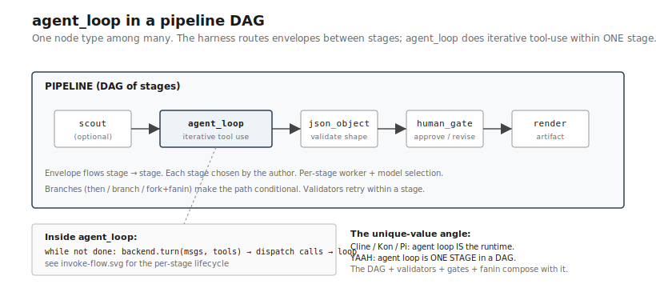
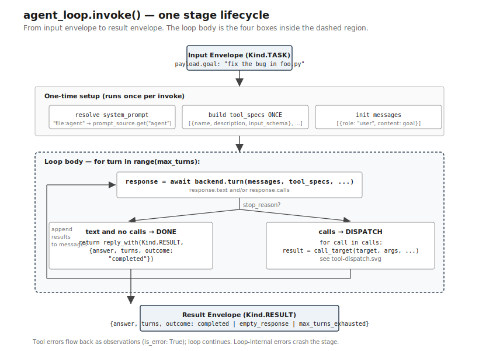
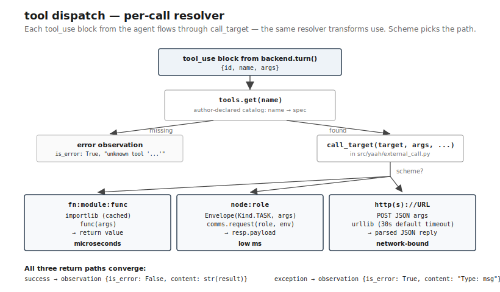

# agent_loop — flow

Three diagrams, top-down: pipeline context, invoke flow, tool dispatch.

## 1. Pipeline context — where it fits

`agent_loop` is one stage type the harness routes between. The DAG
above and around it is what makes YAAH different from one-loop
harnesses — agent_loop is a node, not the whole runtime.

A typical composition:
- A **scout** stage (optional) pre-fetches context
- The **agent_loop** stage does the iterative tool-use work
- A **validator** stage checks structured output
- A **human_gate** stage interposes for approval
- A **render** stage produces the final artifact

Each stage can use a different model / backend / config. The pipeline
declares the data flow; the harness routes between stages.

## 2. Invoke flow — one stage's lifecycle

What happens inside one `agent_loop.invoke(envelope, config)` call.

Step-by-step:

1. **Receive input envelope** — payload contains `goal` (or `input`)
2. **Lazy-resolve system prompt** — if `system_prompt: "file:agent"`,
   call `prompt_source.get("agent")` (once per loop lifetime, cached)
3. **Build tool specs** — render the LLM-facing catalog
   `[{name, description, input_schema}]` ONCE per invoke (not per turn)
4. **Loop until done OR max_turns:**
   - Call `backend.turn(messages, tool_specs, model, system)`
   - **If response has text and no calls** → emit result envelope, exit
   - **If response has calls** → dispatch each, collect results, append
     to messages, continue
5. **Emit result envelope** with `{answer, turns, outcome}`. Outcomes:
   `completed` (final text), `empty_response` (malformed turn),
   `max_turns_exhausted` (budget hit)

Key design choices reflected in this flow:

- **Tool catalog built once, cached.** The LLM-facing tool spec list
  doesn't change between turns; rendering it per-turn would be waste.
- **System prompt lazy-resolved.** The builder doesn't call
  `prompt_source.get()` (async) at build time; the node resolves on
  first invoke, caches forever after.
- **Output envelope chains.** `input.reply_with(Kind.RESULT, ...)`
  preserves `correlation_id`, `causation_id`, `baton` — the run-tree
  stays intact.
- **Tool errors flow back as observations.** A tool throwing doesn't
  crash the stage; the agent sees the error and adapts. Loop-internal
  errors (backend dead, comms broken) crash the stage with a Verdict
  failure.

## 3. Tool dispatch — the per-call resolver

What happens inside each tool call within a turn.

For each `{name, args, id}` in the response's `calls`:

1. **Lookup** `name` in the author-declared catalog
2. **If unknown:** emit error observation `{is_error: True, content:
   "unknown tool 'name' — not in declared catalog [...]"}`. Agent sees
   this on the next turn.
3. **If known:** call `call_target(target, args, comms, reply_to)`
   where `target` is the dispatch string. Resolver branches:
   - **`fn:module:func`** → `importlib` (cached) + direct call.
     Microseconds. No envelope wrap.
   - **`node:role`** → wrap args in `Envelope(Kind.TASK, args)` and
     `Comms.request(role, env)`. Low ms. Used for tools that should
     also be reusable as pipeline stages.
   - **`http(s)://URL`** → POST args as JSON, parse JSON reply.
     Network-bound. Used for external services.
4. **On success:** observation `{is_error: False, content: str(result)}`
5. **On exception:** observation `{is_error: True, content: "ExceptionType: message"}`.
   Agent sees and can retry / adapt.

The resolver is the **same machinery transforms use** (see
[`src/yaah/external_call.py`](../../../src/yaah/external_call.py)) —
one resolver, two entry points. A tool dispatch and a transform
dispatch are the same code path. This is the "compose, don't invent"
discipline in practice.

## What's NOT in this flow (yet)

These are deliberately out of scope for the current `agent_loop`;
they ship later if measurement shows they help:

- **Streaming token output** — the backend returns the whole turn at
  once; no per-token surfacing
- **Parallel tool dispatch** — calls execute sequentially within a turn;
  parallel-via-`asyncio.gather` is a future option
- **Compaction** — messages grow unboundedly within a stage; a
  `before_turn` steering hook would address it
- **MCP-native dispatch** — MCP tools go through a future `mcp_tool`
  node referenced via `node:` dispatch; the `mcp:` scheme is NOT in
  `call_target` (and intentionally won't be — see
  [`external_call.py:15`](../../../src/yaah/external_call.py))

## Where to read the code

- [`src/yaah/nodes/agent_loop_node.py`](../../../src/yaah/nodes/agent_loop_node.py)
  — the loop (one class, ~125 lines)
- [`src/yaah/build/builders.py`](../../../src/yaah/build/builders.py)
  — `_build_agent_loop` (the config-to-node builder)
- [`src/yaah/external_call.py`](../../../src/yaah/external_call.py)
  — `call_target` (the dispatch resolver shared with transforms)
- [`src/yaah/agents/api_provider.py`](../../../src/yaah/agents/api_provider.py)
  — `ApiProvider.stream(context)` (the replaceable backend seam)
- [`src/yaah/agents/tool_loop.py`](../../../src/yaah/agents/tool_loop.py)
  — `run_tool_loop` (the canonical loop AgentLoopNode delegates to)
- [`tests/test_agent_loop.py`](../../../tests/test_agent_loop.py)
  — end-to-end behavior coverage
