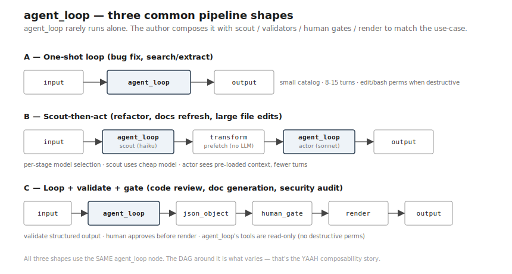

# agent_loop — use cases

Six concrete scenarios. Each shows: the task shape, the tool catalog
the author would declare, the pipeline shape (often agent_loop is one
stage in a larger DAG), and honest limits.

The point of this page: make it clear what `agent_loop` is and isn't
good at, by example.



## 1. Code bug fix

**Scenario:** "Fix the off-by-one in `parse_range` in `src/utils.py`."
Agent reads the file, understands the bug, edits, verifies the change
compiles / tests pass.

**Tool catalog:**
```json
{
  "read":   {"description": "Read a file. NOT cat/head/tail.", "dispatch": "fn:tools:read"},
  "edit":   {"description": "Precise text replacement. NOT sed.", "dispatch": "fn:tools:edit"},
  "bash":   {"description": "Shell for git/tests/builds.",     "dispatch": "fn:tools:bash"},
  "done":   {"description": "Signal completion + summary.",    "dispatch": "fn:tools:done"}
}
```

**Pipeline shape:** one-stage `agent_loop` with `max_turns: 15`. Often
preceded by a `scout` stage that pre-identifies relevant files (per the
scout-prefetch-act pattern).

**Honest limits:** if the bug spans many files or requires architectural
judgment, single-loop bound will hit `max_turns_exhausted`. Decompose
into PCE (plan-critique-execute) or hand off to a human gate.

## 2. Read-only code review

**Scenario:** "Review this PR for security issues." Agent reads the
diff, examines referenced functions, emits structured findings. Cannot
edit.

**Tool catalog:**
```json
{
  "read":  {"description": "Read a file.", "dispatch": "fn:tools:read"},
  "grep":  {"description": "Search file contents.", "dispatch": "fn:tools:grep"},
  "done":  {"description": "Emit findings JSON.", "dispatch": "fn:tools:done"}
}
```

**Pipeline shape:** typically composed with a downstream stage:
`agent_loop` (review) → `json_object` validator (findings shape) →
`render` (markdown report). The author declares NO edit/write tools —
review must be non-destructive.

**Honest limits:** the agent can miss context the diff doesn't show.
Pair with a `scout` stage that pre-fetches related code, OR add a
`recall` tool that lets the agent ask for more.

## 3. Documentation refresh

**Scenario:** "Update `docs/api.md` to reflect the current public
methods of `Service`." Agent reads the class, reads the existing doc,
edits the doc to match.

**Tool catalog:**
```json
{
  "read":  {"description": "Read a file.", "dispatch": "fn:tools:read"},
  "edit":  {"description": "Surgical edits to doc files.", "dispatch": "fn:tools:edit"},
  "grep":  {"description": "Find symbols in code.", "dispatch": "fn:tools:grep"},
  "done":  {"description": "Done.", "dispatch": "fn:tools:done"}
}
```

**Pipeline shape:** one-stage `agent_loop` (max_turns: 10) followed by
a `human_gate` for review. The gate is where the author catches "the
agent invented a method that doesn't exist." Don't ship docs straight
through.

**Honest limits:** if the class is huge, the agent reads the whole
thing every turn (tokens accumulate). Tool-output projection (project
only relevant methods) helps once that pattern is built.

## 4. Test triage

**Scenario:** "Five tests are failing in CI. Classify each as: real
bug / test bug / environmental / unclear." Agent reads each failure,
inspects the code under test, classifies.

**Tool catalog:**
```json
{
  "read":     {"description": "Read a file.", "dispatch": "fn:tools:read"},
  "grep":     {"description": "Search code.", "dispatch": "fn:tools:grep"},
  "git_log":  {"description": "Recent commits on a file.", "dispatch": "fn:tools:git_log"},
  "done":     {"description": "Emit classification JSON.", "dispatch": "fn:tools:done"}
}
```

**Pipeline shape:** a `fork` stage that fans out one `agent_loop` per
failing test (parallel), `fanin` aggregator that reduces to a single
report. Each branch gets a small `max_turns: 8`. Cheap because each
loop is bounded and independent.

**Honest limits:** classification is the bound — the agent doesn't fix
the bugs. Hand off to a `human_gate` (operator picks which to escalate)
followed by N `agent_loop` stages with edit perms.

## 5. Refactor assistant

**Scenario:** "Rename `compute_total` to `aggregate_invoices` across
the codebase." Agent finds call sites, edits each, verifies the project
still builds.

**Tool catalog:**
```json
{
  "grep":  {"description": "Find symbol usage.", "dispatch": "fn:tools:grep"},
  "read":  {"description": "Read a file.",      "dispatch": "fn:tools:read"},
  "edit":  {"description": "Rename in place.",  "dispatch": "fn:tools:edit"},
  "bash":  {"description": "Run build/tests.",  "dispatch": "fn:tools:bash"},
  "done":  {"description": "Summary.",          "dispatch": "fn:tools:done"}
}
```

**Pipeline shape:** one-stage `agent_loop` with high `max_turns: 25`
(many call sites). The build/test step at the end gives the loop a
deterministic verification signal — pair with a `test-driven` pattern
where the verify stage is a separate `shell_check` node.

**Honest limits:** large refactors (50+ call sites) will hit max_turns.
Better shape: a `symbolic-augmented` prefetch stage (LSP/AST find-all-
references) feeds an exhaustive list to the `agent_loop`, eliminating
discovery cost.

## 6. Search & extract

**Scenario:** "Find every TODO that mentions 'security' and return a
list with file/line/context." Agent searches, reads relevant
surroundings, returns structured findings.

**Tool catalog:**
```json
{
  "grep":  {"description": "Search code with regex.", "dispatch": "fn:tools:grep"},
  "read":  {"description": "Read N lines around a match.", "dispatch": "fn:tools:read_range"},
  "done":  {"description": "Emit findings JSON.", "dispatch": "fn:tools:done"}
}
```

**Pipeline shape:** one-stage `agent_loop` with `max_turns: 10`. Could
also be a deterministic transform stage if the search is precise —
`agent_loop` earns its place when the matching needs judgment (e.g.,
"TODOs that *imply* security" not just "TODOs containing 'security'").

**Honest limits:** for purely-syntactic searches, a `transform` node
calling `grep` directly is cheaper (no LLM needed). Reach for
`agent_loop` only when the judgment matters.

## Cross-cutting observations

**The pattern that recurs:** small tool catalog (3-5 tools), bounded
turns (8-25), often composed with other stages (scout, validate,
human_gate, render). One-stage `agent_loop` does the "creative work";
deterministic stages handle the rest. This composition is what makes
YAAH different from one-loop harnesses.

**The author's job:** declare the catalog deliberately. Read-only
tasks get read-only catalogs. Destructive tasks have an opt-in
fence (`edit`/`bash` are explicit, not implicit). The agent has
agency only within what the author allowed.

**When NOT to use `agent_loop`:** if the task is purely deterministic
(grep + transform), skip the LLM. If the task needs many turns of
internal reasoning without tool calls, a one-shot `agent` is better.
If the task spans hours of iterative work, decompose into multiple
stages.
