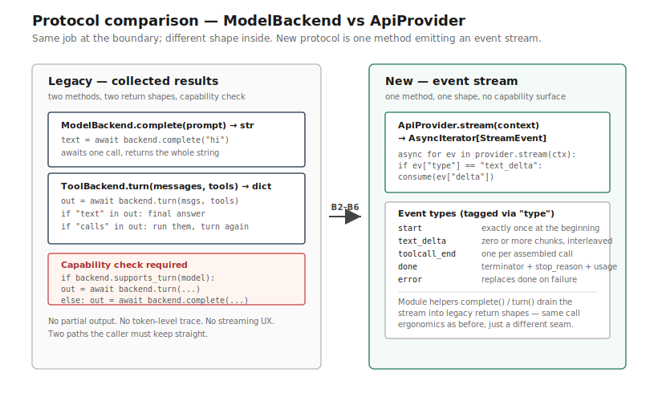
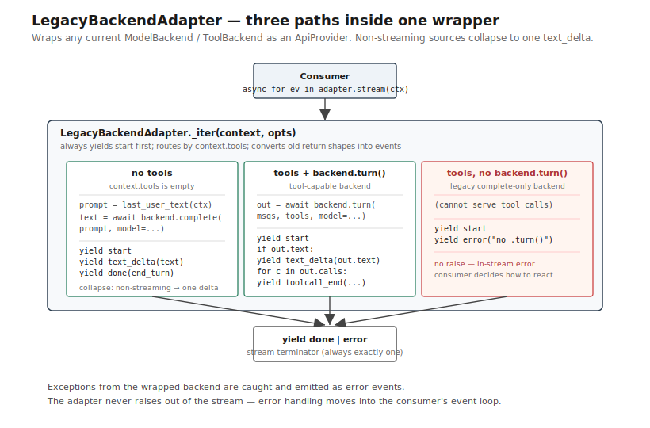
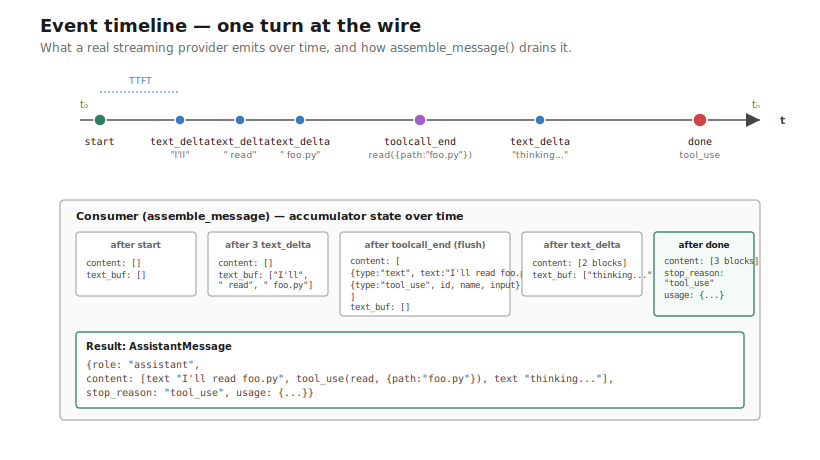
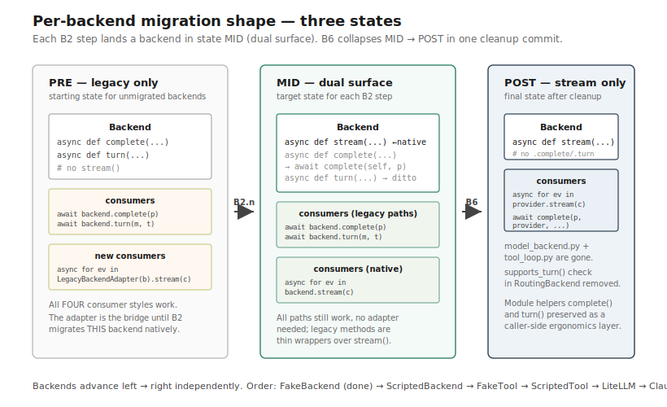

# ApiProvider — flow

Four diagrams: protocol comparison, the LegacyBackendAdapter bridge, the
event timeline of one turn, and the per-backend migration shape.

## 1. Protocol comparison — old vs new

The legacy `ModelBackend` / `ToolBackend` surface vs. the new
`ApiProvider`. Same use cases at the boundary; very different shape
inside.

**Old:** two methods returning collected results. Consumers wait for the
whole response, then process. No way to act on partial output. Two
methods means callers must check `hasattr(backend, "turn")` or use
`supports_turn()`.

**New:** one method returning an event iterator. Consumers process
events as they arrive — text deltas, tool-call events, done events. One
method means no capability check; callers always do the same loop.

The events that compose a turn:
- `{type: "start"}`                    — exactly one, at the beginning
- `{type: "text_delta", delta: str}`   — zero or more, interleaved
- `{type: "toolcall_end", id, name, args}` — zero or more, interleaved
- `{type: "done", stop_reason, usage?}` — exactly one, at the end
- `{type: "error", message}`           — replaces `done` on failure

## 2. LegacyBackendAdapter — the bridge

> **Historical** — the `LegacyBackendAdapter` was removed in MED-001; this
> section documents the migration bridge as it existed through B1–B6.

The adapter lets the new protocol work against EVERY existing backend
from day one. No consumer is blocked waiting for B2 migration.

Three paths inside the adapter:

1. **No tools requested + backend has `complete()`** → call
   `backend.complete(prompt)`, yield one `text_delta` with the full
   string, then `done`. The prompt is reconstructed from
   `context.messages` (last user-role string content).
2. **Tools requested + backend has `turn()`** → call `backend.turn(messages,
   tools)`, project the returned `{text, calls}` shape into events: a
   `text_delta` if text is present, one `toolcall_end` per call, then
   `done` with `stop_reason: "tool_use"` if calls were present.
3. **Tools requested + backend has NO `turn()`** → emit `start` then
   `error` (`legacy backend has no .turn()`). No raise; the error is in-
   stream so consumers can decide how to react.

Any exception from the wrapped backend also becomes an `error` event —
the adapter never raises out of the stream.

## 3. Event timeline — one turn

The wire-level view: what a real streaming provider (LiteLLM, ClaudeCli)
emits over time, and what the consumer accumulates.

Reading top-down:

1. **Provider yields `start`** — consumer can start a trace span,
   timestamp t₀
2. **`text_delta` events arrive** — consumer appends to a text buffer
   AND forwards to UI (if any). Time-to-first-token = first delta's t
3. **A `toolcall_end` arrives** — consumer flushes the current text
   buffer as a `text` content block, appends a `tool_use` block
4. **More `text_delta` events may arrive** after a toolcall (provider-
   dependent; some emit text + tool calls in one assistant message)
5. **`done` arrives** — consumer flushes any pending text, finalizes the
   `AssistantMessage`, records `stop_reason` + `usage`

`assemble_message()` is the canonical drain — it implements exactly this
algorithm. The module-level `complete()` and `turn()` helpers are thin
wrappers around it that project to the legacy return shapes.

## 4. Migration shape — per backend (B2)

The pattern each B2 step follows. After all backends migrate, B6 removes
the legacy methods in one cleanup commit.

**Three states for any backend during B2:**

1. **PRE — legacy only.** Has `complete()` and optionally `turn()`. No
   `stream()`. Consumers use `backend.complete(...)` / `backend.turn(...)`.
   The `LegacyBackendAdapter` can wrap it to satisfy `ApiProvider`.

2. **MID — dual surface.** Has native `stream()`. Keeps `complete()` (and
   `turn()` if it had one) as thin wrappers that delegate to the module-
   level helpers `complete(self, ...)` / `turn(self, ...)`. Behavior
   identical to PRE; existing callers unaffected. `LegacyBackendAdapter`
   becomes unnecessary for THIS backend (consumers can use it directly as
   an `ApiProvider`).

3. **POST — stream only (after B6).** `complete()` / `turn()` removed.
   Module-level helpers stay as the migration affordance for callers
   who haven't been touched. The legacy Protocols and `tool_loop.py`
   are also gone.

A backend in state MID is what each B2 step ships. The dual surface is
deliberate — it lets the migration proceed without coordinating consumer
updates. The cleanup is one commit at the end, not many.

## What's NOT in this flow (yet)

These are intentionally absent from B1's protocol; they ship later if
specific consumers demand them:

- **`toolcall_start` + `toolcall_arg_delta`** — per-arg streaming. The
  current `toolcall_end` (one event per fully assembled call) is enough
  for the tool-loop driver. Operator-UI surfacing of partial tool args
  is use case 2 above — wait for an actual UI consumer.
- **`thinking_delta`** — Anthropic extended thinking blocks. The
  content-block shape allows it (`ThinkingBlock`), but no current
  consumer reads them. Bring in when claude_cli backend exposes them.
- **`compaction`** — provider-side summarization events (Anthropic's
  prompt-caching summary block). Not yet a protocol concern; the
  before_turn steering hook will handle compaction at the consumer layer
  first.

## Where to read the code

- [`src/yaah/agents/api_provider.py`](../../../src/yaah/agents/api_provider.py)
  — protocol, content blocks, helpers (one file; the `LegacyBackendAdapter`
  shown above was removed in MED-001)
- [`src/yaah/agents/fake_backend.py`](../../../src/yaah/agents/fake_backend.py)
  — first backend migrated to native `stream()` (B2.1)
- [`tests/test_api_provider.py`](../../../tests/test_api_provider.py)
  — helpers + assembly coverage
- `src/yaah/agents/model_backend.py` — **removed in B6** (held the legacy
  Protocols; the adapter-bridge sections above are historical)
- [`.notes/phase-1-resume-context.md`](../../../.notes/phase-1-resume-context.md)
  — migration order, decision gate criteria, B2–B6 plan
