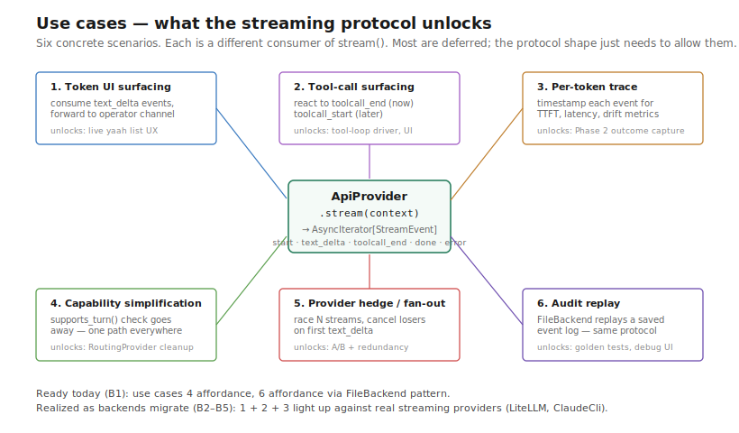

# ApiProvider — use cases

Six concrete scenarios where the streaming protocol pays off. Each shows
what the consumer wants, why a collected-result `complete()`/`turn()`
falls short, and the consumer shape under `stream()`.

The point of this page: make the unlocks concrete, not abstract. Most are
deferred until specific consumers actually need them — but knowing the
shape NOW prevents the protocol from being re-shaped later when they do.



## 1. Token-level UI surfacing (operator visibility)

**Scenario:** an operator watches `yaah list` while a long `agent_loop`
stage runs. Without streaming they see "running… running… running… done"
for 90 seconds. They want to see tokens fall as they arrive.

**Why a stream:** legacy `complete()` returns one string at the end —
nothing to forward incrementally. `stream()` yields `text_delta` events
the operator UI can render as they arrive.

**Consumer shape:**
```python
async for ev in provider.stream(ctx, model=cfg.model):
    if ev["type"] == "text_delta":
        await ui_channel.push(ev["delta"])
```

**Honest limits:** fake / scripted backends collapse to one delta —
streaming gives zero UX gain there. Only the real-model backends
(LiteLLM, ClaudeCli) actually emit incremental chunks.

## 2. Partial tool-call assembly (cost + UX)

**Scenario:** an `agent_loop` stage is about to issue a slow tool call.
The author wants the operator to see "the agent is about to call
`bash('npm test')`" the moment the tool name resolves — not after the
whole `{"command": "npm test"}` blob streams.

**Why a stream:** legacy `turn()` returns a fully assembled `calls` list
at the END of the turn. Anthropic / OpenAI wire formats stream the
tool name first, then partial argument JSON. A `toolcall_start` event
(future addition) plus `toolcall_arg_delta` would surface this.

**Consumer shape (planned, post B5):**
```python
async for ev in provider.stream(ctx):
    if ev["type"] == "toolcall_start":
        await ui_channel.push(f"calling {ev['name']}...")
    elif ev["type"] == "toolcall_end":
        await dispatch(ev["name"], ev["args"])
```

**Honest limits:** B1's protocol only ships `toolcall_end` (one event per
assembled call) — sufficient for the tool-loop driver. Per-arg deltas
land if and when an operator UI actually needs them.

## 3. Per-token trace events (measurement)

**Scenario:** Phase 2's outcome capture wants to record latency-per-token
and time-to-first-token for cost / drift analysis. These can't be
back-computed from a `complete() -> str`.

**Why a stream:** the stream IS a time series. The trace span emits a
sample per event (or per N events), giving the analysis layer enough
signal to detect drift without a separate instrumentation hook.

**Consumer shape:**
```python
t_first = None
async for ev in provider.stream(ctx):
    if ev["type"] == "text_delta" and t_first is None:
        t_first = time.monotonic()
        tracer.emit("ttft", t=t_first - t_start)
    tracer.emit("token", t=time.monotonic())
```

**Honest limits:** TTFT only meaningful for real streaming backends. The
adapter wrapping FakeBackend emits one `text_delta` at end-of-call, so
TTFT == total latency. Capture it anyway — equal-to-end is a valid
signal that "this backend doesn't stream."

## 4. Capability simplification (RoutingBackend)

**Scenario:** `RoutingBackend` currently has a `supports_turn()` helper
because some legacy backends (claude_cli) don't implement `turn()` and
some do (LiteLLM, ScriptedTool). Callers check the capability before
choosing tool-loop vs. manifest-fallback paths.

**Why a stream:** every provider implements `stream()`. There is no dual-
method surface to check capability against. The router's job collapses
to "select provider by prefix, forward stream." The fallback path goes
away.

**Consumer shape (post B7):**
```python
# Old:
if backend.supports_turn(model):
    out = await backend.turn(messages, tools, model=model)
else:
    out = await backend.complete(render_manifest(...), model=model)

# New — one path:
async for ev in provider.stream(ctx, model=model):
    ...
```

**Honest limits:** this is the cleanest win, but it depends on B6 having
finished the migration. Until then `supports_turn` stays for legacy
consumers.

## 5. Provider parallelism (fan-out / hedge)

**Scenario:** the harness wants to hedge — fire the same prompt at two
providers simultaneously and take whichever finishes first (with usage
attribution). Or: fork the same prompt across N models for an A/B test.

**Why a stream:** `complete()` is a single awaitable; you can hedge it
with `asyncio.gather`. But you can't *combine* partial results from
streams (e.g., "show whichever provider's first token arrived first"
without abandoning the other). A stream-based interface makes the cancel-
the-loser pattern obvious.

**Consumer shape:**
```python
streams = [p.stream(ctx) for p in providers]
winner_idx, first_ev = await race_first(streams)
async for ev in streams[winner_idx]:
    consume(ev)
for i, s in enumerate(streams):
    if i != winner_idx:
        await s.aclose()  # cancel the loser
```

**Honest limits:** hedging is a Phase 3 hypothesis, not a current need.
The shape just needs to not actively prevent it.

## 6. Audit replay (post-hoc)

**Scenario:** a Phase 2 outcome record contains the full event log of a
run. An operator wants to replay it to a debug UI — same events, but
from a file, not a live provider.

**Why a stream:** the event log IS the trace. A "FileBackend" or
"ReplayProvider" reads events from disk and yields them — same protocol,
same consumer code. Useful for golden tests too: capture a real
provider's stream once, replay it deterministically in CI.

**Consumer shape:**
```python
async def stream(ctx, **opts):
    for ev in json_lines(self._path):
        yield ev
```

**Honest limits:** replays are deterministic by construction (no
inference). Suited for debugging UI/consumer logic; useless for testing
the model itself.

## Cross-cutting observations

**What the protocol unlocks today (B1):** capability uniformity (every
backend goes through the same shape) + the migration affordance
(LegacyBackendAdapter means consumers don't have to wait).

**What ships as backends migrate (B2–B5):** real token streaming (5–6),
partial tool-call surfacing (3+), per-token tracing (3).

**What ships only post-B6:** capability-check removal (4), hedge /
fan-out cleanly (5). These need every backend native; until then the
shape is right but the wins aren't realized.

**What is NOT a use case:** "always use streaming for everything." The
single-shot `complete()` shape is still appropriate for many call sites
(a `transform` stage that needs a one-line answer doesn't need a UI feed).
The module-level helper `complete(provider, prompt)` preserves that
ergonomics on top of the stream protocol — same one-line caller, stream
plumbing hidden.

## Where these scenarios get exercised

| Use case | Test / consumer (existing or planned) |
|---|---|
| 1 — Token UI | future `yaah ui live` (Phase 2+) |
| 2 — Tool-call surfacing | `tests/test_agent_loop.py` (B5 regression) |
| 3 — Per-token trace | Phase 2 outcome capture |
| 4 — Capability simplification | `tests/test_routing_backend.py` (B7) |
| 5 — Provider hedge | Phase 3 H6 sibling (not yet scoped) |
| 6 — Audit replay | Phase 2 outcome capture |
