# Case study: A/B drives prompt tuning

**TL;DR.** A constrained prompt that helps a small model can hurt a big
one. Don't search for "the prompt." Run two models against each other,
read what each actually produced, and ship two prompts — one per model.

This is the path that took `examples/config-flow`'s default from sonnet
($0.26/run) to haiku ($0.078/run) without losing structural quality.
Three SVGs in this folder show the steps; this document narrates them.

The target throughout is
[`examples/arch-drift/arch-drift.dogfood-self.json`](../../../examples/arch-drift/arch-drift.dogfood-self.json)
— a 4-layer `_extends` chain that exercises every part of config-flow.

---

## Step 0 — what the tool produces

`examples/config-flow` is a yaah pipeline that visualizes how any
*other* yaah config flows: the `_extends` chain, the pipeline graph,
the input fixture, and the registries the pipeline strings resolve
against. The LLM does the layout choices; mmdc renders the mermaid.

The asked-for shape: **four named subgraphs** — extends chain, input
fixture, pipeline graph, effective root registries.

## Step 1 — sonnet, loose prompt (the original)

The first prompt was deliberately open-ended:
[`examples/config-flow/prompts/extract.md`](../../../examples/config-flow/prompts/extract.md)
asks for the four subgraphs but doesn't dictate IDs, directions, or
layout. Sonnet used the freedom well.



What's good here:

- All four subgraphs present and clearly bordered.
- **Horizontal extends chain** (child → parent), a layout-judgment call
  — it reads like an ancestry timeline rather than a stack.
- Edge labels carry semantic content: `no: same`, `yes: changed`,
  `awaiting: human:arch-review`, `revise`/`approve`.
- One annotation only — `model: claude:claude-sonnet-4-6` floating
  off the `extract` node. Restrained.

Cost on this target: **~17K output tokens, ~$0.18–$0.34, 84–230s
wall** (high variance run-to-run).

## Step 2 — haiku, same loose prompt (the problem)

Drop in haiku, same prompt, same target.



What broke:

- **The four-subgraph contract is gone.** Only the pipeline survives
  as a real subgraph. "Configuration: _extends Chain" is there but
  the input fixture (`fixtures/input-self.json`) is a lone node with
  no border, and the registries don't get a subgraph at all.
- **Mixed flow + class-diagram style.** Instead of a *registries*
  subgraph, haiku drew a single `Effective Root Config` node with
  three `contains` arrows fanning out to individual registry nodes
  (`providers.claude`, `prompt_sources.file`, `decisions`). That's a
  class-diagram idiom — it tells you *Effective Root has-a
  providers.claude* — but the rest of the diagram is flow. The
  visual grammar shifts mid-image.
- **Two registries silently dropped:** `state` and `transport` aren't
  shown.
- **Extra `resolves` clutter:** the `extract agent` node grows two
  dotted arrows to `providers.claude` and `prompt_sources.file` —
  redundant with the implicit "contains" tree on the right.

Cost: **~5K output tokens, ~$0.045, ~37s wall.** Cheap and fast, but
structurally worse — a reader has to parse two diagram styles at once
and infer the missing pieces.

First reaction was to keep sonnet as default. The next move was the
interesting one.

## Step 3 — haiku, tight prompt (the fix)

The new prompt
[`examples/config-flow/prompts/extract-strict.md`](../../../examples/config-flow/prompts/extract-strict.md)
spells out exactly what to draw:

- Four named subgraph IDs and titles, in order.
- Per-subgraph layout directions (`direction TB`, `direction LR`).
- A skeleton example with placeholder labels.
- An explicit `# Output requirements` checklist (all four subgraphs
  present, the registries listed as flat nodes inside their
  subgraph, no cross-style mixing).

Same haiku, new prompt.



What changed:

- **All four subgraphs present and bordered.** The class-diagram idiom
  is gone — every registry sits inside the *Effective root: registries*
  subgraph as a flat node.
- **All five registries shown:** `providers.claude`, `prompt_sources.file`,
  `state`, `transport`, `decisions`. (Sonnet's loose-prompt run actually
  showed three — haiku-strict is more complete.)
- Node annotations gained clarity (`extract (agent)`, `gate (human_gate)`)
  — a small win the loose prompt didn't ask for.
- The extends chain stays vertical (`base → leaf`). Sonnet picked
  horizontal, haiku stayed vertical even with the strict prompt — that
  particular layout-judgment call is a sonnet-only behavior. The
  diagram still reads correctly; it's just taller.

Cost: **~13K output tokens, ~$0.07, ~37s wall.** Same speed as
loose-haiku; tokens up because there's more *structure* to fill, not
more prose. Structurally indistinguishable from a sonnet rendering.

## Step 4 — the asymmetry that mattered

Before settling on per-model prompts, the obvious next thing to try
was: *use the strict prompt for both models*. The result was
counter-intuitive.

| Prompt | Sonnet output | Haiku output |
|---|---|---|
| **loose** (`extract.md`)        | ~17K tok, judgment-rich layout            | ~5K tok, broken subgraph contract |
| **strict** (`extract-strict.md`) | **~10K tok, structurally fine but blander** | ~13K tok, fully structured |

The strict prompt **clipped sonnet by ~40% of output tokens**. The
extra constraints turned freely-chosen labels into checkbox-driven
ones; the horizontal extends-chain disappeared; the `awaiting:
human:arch-review` edge label became a plain `awaiting`. Nothing was
*wrong*, but the judgment-rich output that justified paying for sonnet
in the first place was gone.

So both prompts ship. The single-model pipeline (default haiku) uses
`extract-strict.md`. The A/B variant pairs each model with its best
prompt: sonnet+loose vs haiku+strict — *each at its peak*, which is
the only honest comparison.

```jsonc
// examples/config-flow/config-flow-pipeline-ab.json (excerpts)
"role:extract-a": { "model": "claude:claude-sonnet-4-6", "prompt": "file:extract"        },
"role:extract-b": { "model": "claude:claude-haiku-4-5",  "prompt": "file:extract-strict" }
```

## Lesson

When two models look similar on a task, that's a hint to tune the
prompt for each — not to pick one and move on. **A prompt is a model
+ task contract; portability across models is the exception, not the
rule.**

The mechanics that made this discoverable in yaah:

1. **A/B is a first-class pipeline shape** (fork → two agents → fanin →
   write-both). Comparing two models is one config away, not a fork of
   the codebase.
2. **No gate in the A/B variant.** The comparison *is* the artifact —
   both SVGs land in the same dir with `-a` and `-b` appended, and the
   reader's eye picks the winner. No "model judging the model"
   tail-chasing.
3. **`attach:` on the agent node** (ADR-0003) surfaces per-call token
   usage into the payload, so the price column in the table above came
   from the run itself, not a separate accounting pass.
4. **`{base_dir}` placeholders** mean fixtures and prompts stay next to
   the pipeline; trying a new prompt is one file in `prompts/` and a
   one-word edit in the pipeline JSON.

If you're tuning a prompt for a multi-model pipeline, the cheapest
useful thing to do is run the A/B variant once with the loose prompt,
open both SVGs side by side, and look — not for "which is better" but
for **what each model wants more (or less) of**. That's where the next
edit comes from.

## How to reproduce

```bash
# regenerate haiku-strict (the current default) for any config:
examples/config-flow/visualize examples/arch-drift/arch-drift.dogfood-self.json

# full A/B (sonnet+loose vs haiku+strict) for the same:
cd examples/config-flow
python3 -m yaah.runtime config-flow-ab.real.json
# → two SVGs in examples/arch-drift/diagrams/, -a (sonnet) and -b (haiku)

# the "before" — haiku+loose — was produced by temporarily swapping
# file:extract-strict → file:extract in config-flow-pipeline.json's
# role:extract node, running once, then reverting. The SVG in this
# folder is from that one-off run on 2026-06-19.
```

## Files in this folder

- `sonnet-loose.svg` — sonnet + `prompts/extract.md`. The original, the
  reference quality.
- `haiku-loose.svg` — haiku + `prompts/extract.md`. The "before" — what
  motivated the prompt tightening.
- `haiku-strict.svg` — haiku + `prompts/extract-strict.md`. The current
  default in `config-flow-pipeline.json`.

All three target the same input
(`examples/arch-drift/arch-drift.dogfood-self.json`) so the only
variable is `(model, prompt)`.
