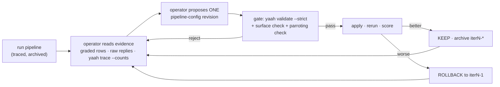

# The operator loop — an AI improves a running pipeline, under a safety envelope

Copy this pattern when a pipeline's quality is **measurable** and you want an AI —
not a human — to do the tuning: read the run evidence, propose a config change, and
have the harness (not trust) keep it safe. There is no special mode: the run/apply/
inspect steps are shipped yaah verbs (`run`, `validate`, `trace`, `rollback`), and the
gate's judgement steps — surface lock, the anti-parroting check, the structural diff,
the per-iteration archive — are procedures the coordinator runs around them, not engine
features. The verbs enforce; the coordinator decides.

**Proven result (2026-07-07, real models):** an opus operator took a haiku extraction
pipeline from **8/24 (33%) to 23/24 (96%) in two config-only iterations** — every
proposal validated, gated, diffed, and archived; every model call traced. Its score
predictions were exact both times (21 → 21, 23 → 23): the operator held a working
causal model of the pipeline, not a lucky prompt.

| Iteration | Score | The operator's move |
|---|---|---|
| 0 (baseline) | 8/24 | weak prompt: the model invents a different ad-hoc schema per input |
| 1 | 21/24 | found the root cause (no output contract) → added `output_schema` with a severity `enum`, letting the ENGINE's schema-repair re-ask enforce the shape; fenced untrusted input with `{{!key}}` |
| 2 | 23/24 | reverse-engineered the grader from 3 corrections → rewrote the rubric as ordered rules + a default-down tie-break |

## The loop

Stop at a target score, a fixed iteration cap (2–3 is usually enough), or the first
rejected-twice proposal.

## The safety envelope — each risk has a named owner

The envelope is what makes this different from "let the AI edit prod". Some rows are
enforced by a shipped verb (`yaah validate --strict`, `{{!key}}` fencing, the trace
sink + `yaah trace --counts`); the rest — surface lock, the anti-parroting check, the
structural diff, the per-iteration archive — are procedures the coordinator performs
each iteration. The "Contained by" column names which is which:

| Risk | Contained by |
|---|---|
| Operator games the metric (reward hacking) | **surface lock**: the operator may edit ONLY the pipeline config; the scorer, fixtures/ground truth, and root config are off-limits — the gate rejects any proposal touching them |
| Overfits to the test set | **anti-parroting rule** at the gate: the prompt must plausibly work on an input the operator has never seen; calibration examples must be invented, not quoted fixtures |
| Proposal breaks the pipeline | **`yaah validate --strict`** before any run — the same author-time contract every human edit passes |
| Change makes things worse | **per-iteration archive** (`runs/iterN-pipeline.json` + output + trace) and keep-or-rollback by score, never by vibes |
| Prompt injection via processed data | **`{{!key}}` fencing** on the agent template for any untrusted text |
| "What did it actually change?" | structural **diff of the proposal vs the applied config** (the iteration-2 proposal above verifiably changed exactly one key: `nodes.extract.template`) |
| "What did it cost / call?" | **trace file sink** + `yaah trace --counts` per run |

## Recipe

1. **Make quality a number.** A deterministic scorer (a `transform` comparing outputs
   to ground truth, a validator pass-rate, an error-count over a fixture set). No
   score, no loop — "looks better" cannot gate anything.
2. **Wire the pipeline for evidence**: trace `mode: tracer` + a file sink, and have
   the run's graded detail land somewhere readable (the scorer's rows in the Done
   payload is enough).
3. **Freeze the surface.** Decide what the operator may touch (usually: the agent
   node's template / `output_schema` / validators / model knobs, plus explicitly named
   stage knobs) and what it may not (scorer, ground truth, everything else). Write
   both lists into the operator's brief.
4. **Brief the operator** (any capable model; the proven run used opus). Give it: the
   pipeline dir read-only, the graded rows + raw model replies + trace, the surface
   rules, the anti-parroting rule, and demand per iteration: diagnosis → ONE complete
   revised config → rationale mapping each change to specific lost points → a
   predicted score. The prediction is your calibration check on the operator itself.
5. **Gate every proposal**: `yaah validate --strict`, diff it (did it touch only the
   surface? did it claim "only X changed" — verify structurally), scan calibration
   examples for fixture text.
6. **Run, score, decide**: better → keep + archive; worse → rollback + hand the
   operator the failure evidence. Feed results back to the SAME operator (context
   intact) — its iteration-2 quality came from remembering its own iteration-1 model.

## Use cases in practice

| Use case | What the operator optimizes | Evidence it reads |
|---|---|---|
| **Cheap-model calibration** (the proven one) | make haiku-tier match sonnet-tier on YOUR task — tight prompt + output contract | graded rows vs ground truth |
| **Model migration** | provider/model swap holding quality: propose per-model prompt variants (loose-prompt models vs tight-prompt models need different prompts) | before/after scores on the same fixtures |
| **Cost tuning** | `model-cascade` thresholds, `max_concurrent`, prompt-length diet | `yaah trace --counts` (calls, tokens, p95) |
| **Drift repair** | production scores sag → diagnose from traces which stage/input class regressed, propose the fix | score history + trace diff between good and bad runs |
| **Validator hardening** | turn observed bad outputs into `output_schema`/validator tightening so failures move from downstream to the repair re-ask | `failed_items`, validator verdicts |
| **A/B refinement** | operator proposes the variant, `yaah ab` measures it on traffic instead of a fixed set | `yaah ab --golden` diffs, completion rates |

## Footguns

- **Subjective rubrics can't be inferred forever.** The proven run's last lost point
  was a genuinely arguable severity boundary; tightening the rubric to fix three
  over-ratings regressed one other item. If a field is judgment-based, put the rubric
  in the task spec — an operator inferring it from N corrections converges but
  oscillates at the boundary.
- **Held-out data or it didn't happen.** Scoring on the same fixtures the operator
  saw proves the loop mechanics, not generalization. For a claim you'd repeat, keep a
  held-out set the operator never reads, or A/B on live traffic.
- **Don't skip the prediction.** Requiring a predicted score per proposal is the
  cheapest operator-quality signal you can get: exact predictions = causal model;
  wild ones = prompt roulette, tighten the brief.
- **The gate is the product.** Dropping the surface lock or the parroting check to
  "move faster" converts this from an audited improvement loop into an unsupervised
  metric chase — the one thing the pattern exists to prevent. Say "gated operator
  loop", never "self-improving pipeline".

## What this is NOT

Not autonomy: a human-role gate reviews every proposal, the surface is bounded, and
the score — not the operator — decides keep/rollback. That is the point, not a
limitation. It is also not magic: the operator's leverage came from yaah exposing
everything as data (configs, contracts, graded rows, traces) — the same properties
that make pipelines easy for humans to review make them improvable by machines.
