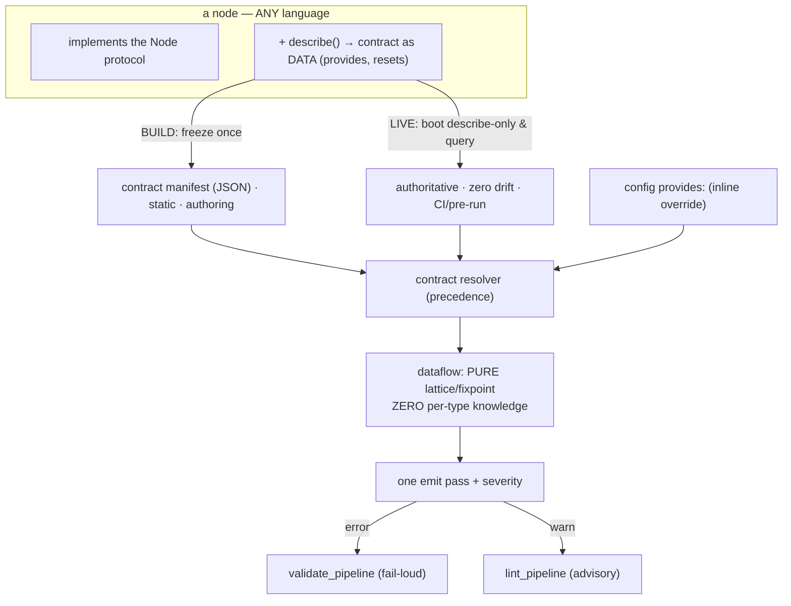
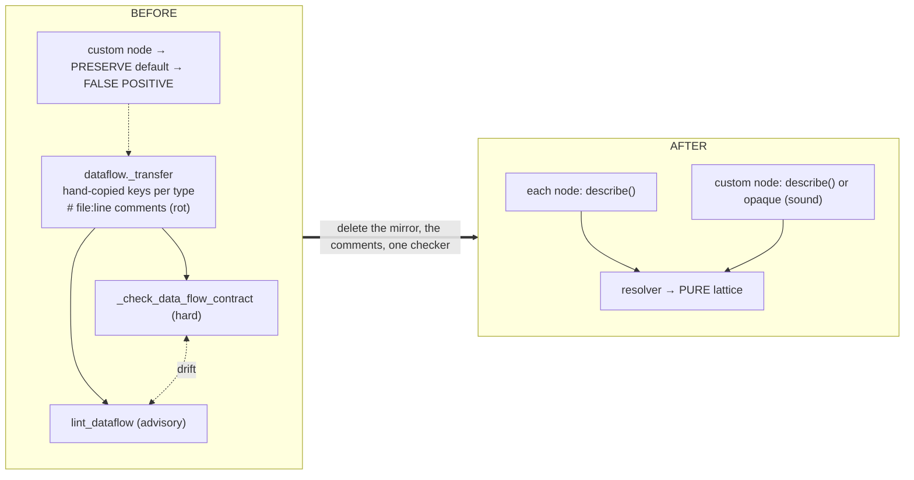
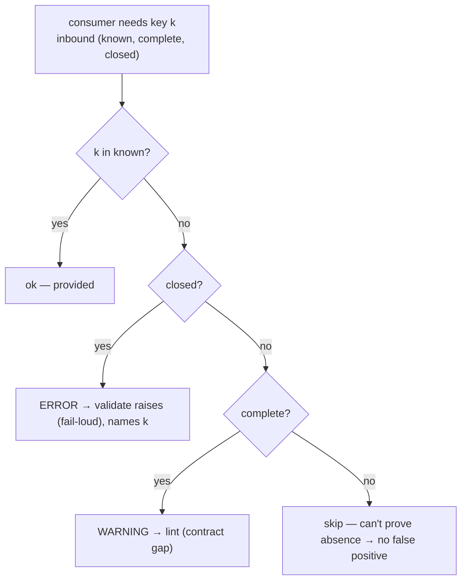
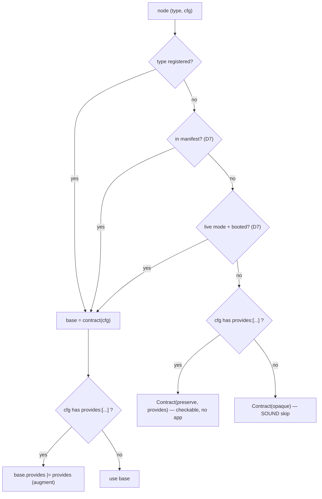

# 0006 — The node contract capability (`describe`): one source of truth for data-flow contracts

**Status:** Proposed (design only — no engine code yet)
**Date:** 2026-07-01
**Supersedes/​reframes:** ADR-0005 slice D (the Python `@provides` extractor) — that decorator
becomes *one language's way to implement this*, not the mechanism.

## Context

ADR-0005's data-flow lint must know, for each node, which payload keys it puts on the payload, so
it can check whether a downstream `{{placeholder}}` / `branch.on` is provided. Today that knowledge
is **hand-mirrored**:

- `dataflow._transfer` hard-codes each node's output keys, stringly-keyed by `type`, kept in sync
  with the node implementations by `# shell_node.py:47`-style comments that rot.
- Two checkers re-derive the same facts at two severities: `validate._check_data_flow_contract`
  (hard, raises) and `dataflow.lint_dataflow` (advisory). They can drift.
- It is **unsound for the open registry**: a custom `register()`'d node isn't in the switch, falls
  through to the PRESERVE default (`dataflow.py`, keeps `complete=True`), and a custom node that
  *adds* an undeclared key then produces a downstream **false positive**. The module advertises
  soundness it only has for the closed set of built-ins it enumerates.

Two hard constraints shape the fix:

1. **Portable to any language.** YAAH may be ported (Python today; a C/Rust port tomorrow). The
   contract mechanism must not depend on Python introspection (`@provides` + `importlib`) — a C port
   has no decorators. The contract must cross as **data**, not via language reflection.
2. **Author-time help on incomplete configs.** The lint must assist while a pipeline is still being
   written (graph half-wired, targets maybe absent) — so it cannot *require* building/running the
   pipeline.

## Decision

**Make the node's output contract a capability the node exposes as data — `describe()` — and have
the engine consume a language-neutral descriptor from it. `dataflow.py` keeps ONLY the graph
math; it gains zero per-node knowledge.**

### 1. `describe()` is the primitive
Every node type can report its contract as a **language-neutral descriptor** — `{ provides: [key…],
resets: bool }` (completeness per ADR-0005's `(known, complete)` lattice). This travels as **data over
the protocol** (reflection-over-wire), so any language implements it trivially — a C node already
speaks the envelope protocol; adding a `describe` reply is small. This is *far* less per-port work
than parsing decorators/macros out of source.

### 2. One capability, two binding times
`describe()` is read at whichever binding time fits, feeding the SAME descriptor into the lint:

| Binding time | Contract source | Tolerates incomplete config? | Role |
|---|---|---|---|
| **Authoring** | inline `provides:` + **frozen manifest** (build-time snapshot of `describe()`) | **yes** — lint what's wired, skip the rest | incremental, cheap, every save |
| **CI / pre-run** | **live `describe()`** (boot harness in describe-only mode, query over the bus) | no — needs a build-valid graph | authoritative deep gate, zero drift |
| always | inline config `provides:` | yes | override / escape hatch |
| fallback | none declared → **opaque → skip** | yes | sound (never the PRESERVE false positive) |

The manifest is **not** a speed cache — it is what makes author-time linting of *extensions* possible
at all: live `describe()` cannot run on an in-progress config, so the frozen contract decouples
"have the contract" from "can build/run the node."

### 3. One analysis, two severities
Fold `_check_data_flow_contract` into the lattice: a single pass emits **error** for the certain/closed
cases (fail-loud at load) and **warning** otherwise. `validate_pipeline` takes the errors,
`lint_pipeline` the warnings. Delete the parallel checker (~85 lines).

### 4. The Python `@provides` decorator is demoted to an adapter
It becomes one language's ergonomic way to implement `describe()` / emit the manifest — a replaceable
adapter (like the backend adapters), not the mechanism. Config `provides:` stays the neutral override.

## Data flow (target)

## What this deletes (the "no sync by hand" payoff)

## Consequences

**Positive**
- **No hand-sync, no rot.** The contract lives once, on the node; the lint reads it. The
  `# file:line` comments and the whole `_transfer` type-ladder disappear.
- **Sound for the open registry.** A custom node declares `describe()` (checkable) or is opaque
  (skipped) — never the PRESERVE-default false positive.
- **Portable.** The seam is data (a descriptor over the protocol / a JSON manifest), not Python
  reflection. A C port implements `describe()` in C; the lint and descriptor format are unchanged.
- **Single source of truth** = the node itself; live mode has zero drift.
- **Author-time help preserved** via the manifest, and **one** data-flow analysis instead of three.
- More aligned with the cosmology (ADR-0001): a node is a service that speaks a protocol; the
  contract is just another protocol answer.

**Negative / accepted tradeoffs**
- Adds a `describe`/contract capability to the Node protocol — every node type and every port
  implements it (small, but it is surface).
- Live mode needs a **describe-only boot mode** so linting doesn't open DBs/networks or run real
  work; leans on the existing fake/scripted machinery.
- Manifest generation is a build step (the freeze). Acceptable — it's what buys static/portable.
- Migration touches every built-in node + the lint + validate. Do it behaviour-preserving first.

## Alternatives considered (rejected)

- **Keep the hand-mirror** (status quo) — the slop this replaces; unsound for custom nodes.
- **Central `node_contracts.py` table** — decouples from the lattice and kills the comments, but a
  central table still can't know app-registered types → the soundness hole stays.
- **Per-language SOURCE extractor** (parse `@provides` / C macros / Rust attributes out of source) —
  a fragile parser rebuilt for every port; `describe()` is trivial by comparison.
- **Config-`provides`-only** — pushes N-way duplication onto every pipeline that uses a custom node;
  the same hand-sync slop, externalized to users.

## Migration slices (design order; each keeps the suite green)

1. **Descriptor schema + precedence resolver** (spec + a pure `resolve_contract(node, sources)`).
2. **Add `describe()` to the Node protocol**; built-ins implement it by *moving* their `_transfer`
   branch onto the node — behaviour-preserving, no lint change yet.
3. **`dataflow._transfer` reads the resolver**; drop per-type knowledge + `# file:line` comments;
   unknown → opaque (not PRESERVE). Add the custom-node false-positive regression test.
4. **Fold `_check_data_flow_contract` into the lattice** (two severities); delete it.
5. **Manifest** = freeze `describe()`; author-time lint reads manifest + inline config.
6. **Live describe-only mode** for CI (later; needs the boot-mode work).
7. **Drive-by:** extract templating (`_PLACEHOLDER` + `_fill`) to one module (kills that dup too).

Steps 1–3 remove the sync-by-hand and the soundness hole; 4 removes the duplicate checker; 5–6 are
the portable binding-time story; 7 is cleanup. `@provides`/`--from-code` (ADR-0005 slice D) is kept
but re-cast as the Python `describe()` adapter, not a separate mechanism.

---

# Design specification (NORMATIVE — an implementer MUST follow this)

Prescriptive. Where it says MUST, deviating is a bug. **Scope of this spec:** the
statically-computable core (registered contract functions + resolver + lattice + two-severity emit)
— enough to delete the hand-mirror, fold the two checkers, and be sound for the open registry via
inline `provides`/opaque. The portable bindings (frozen manifest, live `describe()`) are given as
**requirements only** (§D7); their on-disk/wire detail is a later slice because they must handle
config-dependence.

## D1. The Contract type (the descriptor)

A node's contract is computed from its config and is EXACTLY these four fields:

    Contract = {
      mode:     "preserve" | "reset" | "opaque",
      provides: frozenset[str],   # preserve → keys ADDED to inbound; reset → the FULL emitted set; opaque → ignored
      complete: bool,             # DECLARED-exact? (a contract assertion — check_schema allows extras)
      closed:   bool,             # RUNTIME-exact? (provable — no conditional/undeclared keys).  closed ⟹ complete
    }

`complete`/`closed` matter only for `mode="reset"`; for `preserve` they are inherited, for `opaque`
they are forced `False` (see §D4). The language-neutral JSON form (manifest / wire) is the same four
fields.

## D2. The node contract function + the full built-in table

Each node TYPE has a pure `contract(cfg: dict) -> Contract`. It MUST NOT run the node, do I/O, or
raise (a malformed cfg → the safest Contract, never an exception). For built-ins it is registered
beside the builder: `register(type, builder, contract)`. This IS the static binding of `describe()`.

**MOVE the current `dataflow._transfer` logic into these functions VERBATIM — behaviour MUST NOT
change (except the intentional severity broadening in §D5, flagged for review).** Helpers:
`carry = _as_key_set(cfg.get("carry"))`; `cwd = {cfg["cwd_from"]}` if it's a non-empty str else `{}`.

> **‡ An agent is NEVER `closed`.** An agent merges its whole parsed reply onto the payload
> (`agent.py:388` spreads `**parsed`), and `check_schema` does not enforce `additionalProperties`
> (`jsonschema.py` handles only `type/enum/required/properties/items`) — so the model can emit keys
> the schema never listed and they still get through. We therefore can NEVER prove an agent's output
> is exactly its declared keys. `output_schema` makes it `complete=True` (a declared contract → a
> downstream miss is a WARNING) but never `closed=True` (a crash-certain proof → a hard ERROR).
> Getting this wrong hard-fails valid pipelines — the eval caught it.

| type / cfg condition | mode | provides | complete | closed |
|---|---|---|---|---|
| `agent`, `parse=false` | reset | `{"raw"} ∪ carry ∪ cwd` | T | **T** |
| `agent`, `parse=true`, has `output_schema` or `provides` | reset | `schema.properties ∪ schema.required ∪ {"raw"} ∪ carry ∪ cwd ∪ provides` | T | **F** (never closed — see note ‡) |
| `agent`, `parse=true`, no `output_schema` | reset | `{"raw"} ∪ carry ∪ cwd` | **F** | F |
| `transform`, `call="args"` | preserve | `{cfg.get("into","result")}` | — | — |
| `transform`, `call="envelope"`, `provides` is a list | preserve | `set(provides)` | — | — |
| `transform`, `call="envelope"`, `provides` absent | opaque | — | — | — |
| `render` | preserve | `{"output","path"}` (also `unfilled` only if `allow_unfilled` — omit; too exotic to read) | — | — |
| `human_gate` | preserve | `{"decision"}` | — | — |
| `get` | preserve | `{cfg.get("into","data")}` | — | — |
| `post` | preserve | `{cfg.get("into","stored")}` | — | — |
| `shell` | reset | `{"exit_code","ok","stdout_tail"} ∪ cwd ∪ carry` | T | **F** ← `stdout`/`timed_out` are conditional |
| `worktree`, `op="remove"` | reset | `{"removed","ok"}` | T | **T** |
| `worktree`, else (`op="add"`, default) | reset | `{"workdir","branch","repo","base"} ∪ carry` | T | **T** |
| `agent_loop` | preserve | `{"answer","turns","outcome"}` | — | — |
| `json_object`/`json_schema`/`expect_field`/`shell_check` (validators, as a MAIN node) | reset | `{"status","severity","failures"}` | T | **T** ← returns a Verdict → fresh payload |
| routing stage (`node` is None) | preserve | `{}` | — | — |
| unknown type, no contract (see resolver) | opaque | — | F | F |

## D3. The resolver — one function, fixed precedence

`resolve_contract(type, cfg, *, registry, manifest=None, live=None) -> Contract`, MUST NOT raise:

    base := registry.contract_for(type)(cfg)     if type registered
          else manifest.lookup(type, cfg)        if manifest has it        # §D7, later
          else live.describe(type, cfg)          if live active & booted   # §D7, later
          else None
    inline := cfg.get("provides") if isinstance(list) else None
    if base is None:
        return Contract(preserve, set(inline), —, —)  if inline is not None   # author-declared → checkable, no app
        return Contract(opaque,   ∅, False, False)     otherwise               # SOUND: never PRESERVE-default
    else:
        if inline: base.provides |= set(inline)        # inline AUGMENTS a known contract
        return base

**MUST:** an unknown/undeclared node resolves to `opaque`, NEVER preserve-with-complete — that
preserve-default is exactly today's soundness bug (a custom node adding a key → downstream false
positive).

## D4. The lattice transfer (apply a Contract to the inbound)

Inbound `pin = (known_in, complete_in, closed_in)`; `transfer(pin, c, sticky)`:

- `mode preserve` → `(known_in ∪ c.provides ∪ sticky, complete_in, closed_in AND c.closed)`
- `mode reset`    → `(c.provides ∪ sticky,             c.complete, c.closed)`
- `mode opaque`   → `(sticky,                          False,      False)` + record taint (companion nudge)

**`closed` propagation through preserve — the refinement found during implementation (test to
falsify).** `c.closed` on a contract means "THIS node's key contribution is RUNTIME-exact, not
merely declared." So a preserve node keeps inbound `closed` only if its OWN additions are exact:
- built-in preserve nodes (render, gate, get, post, agent_loop, args-transform, validators) add
  ENGINE-defined keys that are always present → `c.closed = True` → they carry `closed` through.
- a **declared envelope-transform** (and a custom node's inline `provides`) add AUTHOR-declared
  keys — a contract, not a runtime proof → `c.closed = False` → the flow keeps `complete` (so a
  downstream miss is still surfaced as a WARNING) but drops `closed` (so an under-declaration can
  NEVER become a false-positive hard ERROR). The original D4 draft inherited `closed` through all
  preserve nodes unconditionally; that would fail-loud on a valid pipeline whose declared
  transform emits more keys than it lists. `apply` therefore ANDs `c.closed`, and there are two
  preserve constructors: `preserve(...)` (engine, closed) and `preserve_declared(...)` (declared,
  not closed).

**A routing stage (`node` is None — a fork/fanin with no node) MUST short-circuit to
`Contract(preserve, ∅)` BEFORE the resolver is called** — do NOT pass `type=None` to
`resolve_contract` (it would return `opaque`, reset completeness to False and taint, killing
data-flow checks across every fork/fanin). This matches the current passthrough (`dataflow.py`:
`node is None → (known ∪ sticky, complete)`).

The fixpoint is unchanged from ADR-0005 EXCEPT it threads a THIRD component:
`meet((ak,ac,acl),(bk,bc,bcl)) = (ak ∩ bk, ac and bc, acl and bcl)`; `_TOP` identity and the
reachable-predecessor guard are unchanged. **`dataflow._transfer` MUST lose ALL per-type knowledge**
— for a node it becomes: `c = resolve_contract(type, cfg, …)`; apply the three rules above. The
`_shell_keys`/`_worktree_keys`/type-ladder and every `# file:line` comment MUST be deleted.

## D5. Emit — one pass, two severities (folds `_check_data_flow_contract`)

For each consumer — a `render`'s `{{key}}` placeholders, a `branch.on` key — with inbound
`(known, complete, closed)` and needed key `k`:

- `k ∉ known AND closed`                    → **ERROR**   (validate_pipeline raises; message names `k`)
- `k ∉ known AND complete AND not closed`   → **WARNING** (lint_pipeline; contract-gap wording, not "crash")
- otherwise                                 → **skip** (cannot prove absence → never a false positive)

`validate_pipeline` collects the ERRORs (raises if any); `lint_pipeline` collects WARNINGs.
`_check_data_flow_contract` is DELETED; this pass replaces it.

> **BEHAVIOUR CHANGE — flagged for review:** today the hard error fires ONLY for a `parse=false`
> agent single-hop. Under D5 it fires for ANY provably-absent key after a `closed` reset
> (`parse=false` agent, `worktree`), graph-wide (multi-hop). This is a deliberate *broadening* of
> fail-loud (the elegance eval called out that the current single-hop check misses e.g.
> `parse=false → args-transform → render`). Nothing that runs today starts failing UNLESS it reads a
> key that is genuinely, provably absent. `shell` is `closed=False`, so `{{stdout}}` after a shell
> stays a WARNING (conditional key), not a new hard error. **Confirm you want this broadening.**

## D6. Invariants (MUST NOT break — the eval checks these)

1. **Domain-free:** `dataflow.py` names no app concept; every node key set lives in that node's
   `contract(cfg)`, not the lattice.
2. **Never raises:** `lint_pipeline`, `resolve_contract`, and every `contract(cfg)` never raise.
3. **Zero false positives:** only `closed`- or `complete`-proven absences are ever flagged.
4. **Default `yaah validate` imports NO app code** (registry built-ins only; custom → inline/opaque).
5. **Behaviour-preserving through step 4** except the §D5 broadening: the existing 86-test suite
   stays green (adjust only the tests that assert the old two-checker structure).

## D7. Portable bindings (REQUIREMENTS ONLY — later slice, needs its own design pass)

- **Config-dependence problem:** a Contract depends on cfg (`worktree.op`, `agent.parse`,
  `output_schema`). A per-TYPE manifest is therefore INSUFFICIENT. The manifest MUST be either (a) a
  per-node-INSTANCE freeze produced for a specific pipeline at build, or (b) rules the port
  evaluates against cfg. Do NOT ship a naive `type → keys` manifest.
- **Live `describe(cfg)`** MUST take the node's config and return a Contract (§D1) as data over the
  protocol, and MUST run in a describe-only boot mode (no real backends / IO / side effects).
- Both MUST emit the same four-field Contract the resolver already consumes.

## D8. Use cases (ACCEPTANCE — the design MUST satisfy each)

| UC | Scenario | Expected |
|---|---|---|
| UC1 | built-in pipeline (hello-yaah), `yaah validate`, no app present | all nodes checked; zero app import |
| UC2 | `agent(parse=false)` → `render "{{verdict}}"` | **validate RAISES** (fail-loud); message names `verdict` |
| UC3 | `agent(parse=false)` → `render "{{raw}}"` | accepted (`raw ∈ provides`) |
| UC4a | `shell` → `render "{{exit_code}}"` | accepted |
| UC4b | `shell` → `render "{{stdout}}"` | **WARNING** (conditional key; not a hard error) |
| UC5 | custom node type, `provides:["k"]` in config → `render "{{k}}"` | accepted, **no app** |
| UC6 | custom node type, no contract, no `provides` | **opaque → skip** (sound; companion nudge; no false positive) |
| UC7 | custom node in a C port | implements `describe(cfg)` over protocol (live) or ships a per-instance manifest → same Contract → checked |
| UC8 | half-written config (unwired stage, absent target) | static lint still helps; unknown → opaque; **never crashes** |

## D9. Migration (each step keeps the suite green; acceptance per step)

1. **Contract type + `resolve_contract` + built-in `contract(cfg)` fns** (§D1–D3). Acceptance:
   unit-test each built-in's Contract vs the D2 table; `resolve_contract` unknown→opaque, inline→preserve.
2. **Register contracts** beside builders (`register(type, builder, contract)`); no lint change yet.
   Acceptance: registry exposes `contract_for`; suite green.
3. **Rewrite `dataflow._transfer`** to `resolve_contract` + §D4; DELETE the type-ladder,
   `_shell_keys`/`_worktree_keys`, and `# file:line` comments; unknown→opaque. Acceptance: suite green;
   NEW test — custom node that adds an undeclared key does NOT false-positive downstream (the D6-3 hole).
4. **Fold severity** (§D5); DELETE `_check_data_flow_contract`. Acceptance: UC2–UC4 pass; the §D5
   broadening reviewed & accepted; suite green.
5. **Manifest** (§D7a) — freeze `describe()` per instance; author-time lint reads manifest + inline. (own design)
6. **Live describe-only mode** (§D7b) for CI. (own design)
7. **Drive-by:** extract templating (`_PLACEHOLDER` + `_fill`) to one module. Acceptance: one copy, suite green.

## Images

**Severity decision (§D5):**

**Resolver precedence (§D3):**

## Review record (adversarial eval, 2026-07-01)

The eval verified every D2 row against the node `invoke()` bodies and ran two pipelines through the
current engine. Verdict: architecture sound (resolver, opaque-fallback, 3-bit lattice math, two-
severity emit all check out), but four spec bugs would have made the linter **hard-fail pipelines
that run today**. All four are now fixed above:

1. **Agent `closed=True` was a lie** — `additionalProperties:false` isn't enforced and the agent
   merges the full parsed reply, so a `render "{{summary}}"` after an agent that emits `summary` but
   only declares `verdict` would wrongly hard-fail. → agent is now never `closed` (see note ‡).
2. **`get`/`post` default key was wrong** — table said `into="result"`; real defaults are
   `"data"`/`"stored"`. A `render "{{data}}"` after a default `get` would wrongly hard-fail. Fixed.
   (This is also a **latent bug in the current `dataflow.py`**, which uses `"result"` too — fix it
   when implementing step 1.)
3. **Fork/fanin routing stages** would have gone opaque and silently killed all data-flow checks
   across them → added the `node is None → preserve` short-circuit in D4.
4. **`worktree op=remove`** doesn't apply `carry` → dropped `∪ carry` (was a harmless over-claim).

`shell closed=False` (conditional `stdout`/`timed_out`) and `worktree closed=True` were verified
sound. With these four edits the design is implementable.

## Review record (adversarial code-eval, 2026-07-02, on the implementation)

A second eval verified the built contracts against every node's `invoke()` body. All sound EXCEPT
one, now fixed:

5. **Validators mismodelled as passthrough.** `json_object`/`json_schema`/`expect_field`/`shell_check`
   used as a MAIN node return a `Verdict`, which `to_envelope` → `reply_with` turns into a FRESH
   payload of exactly `{status, severity, failures}` — they RESET, dropping inbound keys. Modelling
   them `preserve()` caused a **confirmed false positive** (`agent(parse=false) → json_object →
   render "{{status}}"` runs fine but was hard-blocked) and let a migrated test bless a
   runtime-broken `branch on raw`. → `validator_contract` now returns
   `reset({status,severity,failures}, closed=True)`; the D2 row and the test are corrected.

Also confirmed sound during implementation (beyond the spec): the **`closed`-through-preserve
refinement** (see D4) — a declared envelope-transform / custom inline-`provides` node keeps
`complete` but drops `closed`, so an under-declaration can never become a false-positive hard error.
Every built-in preserve node's added keys were verified UNCONDITIONALLY present (so keeping `closed`
is sound). Slice B5 (templating extraction) landed too: one `templating.py` (`PLACEHOLDER` + `fill`)
replaces the 3 regex copies + 2 `_fill` copies.
