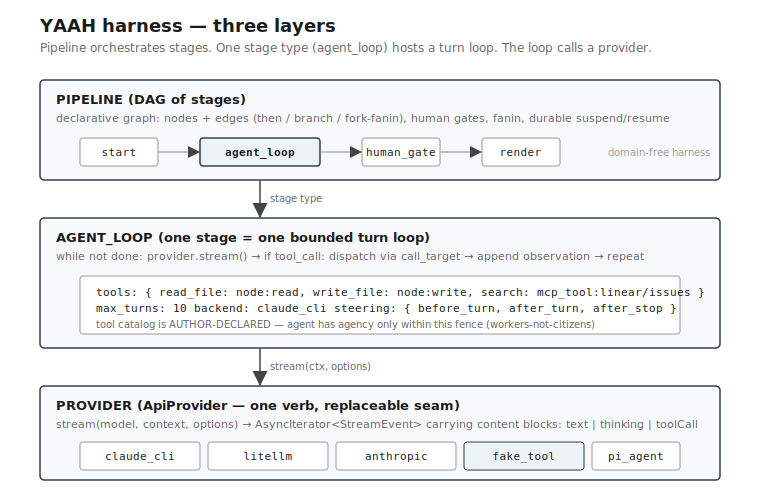
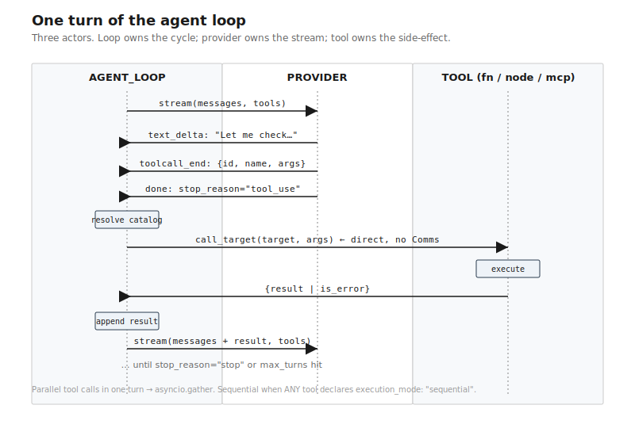
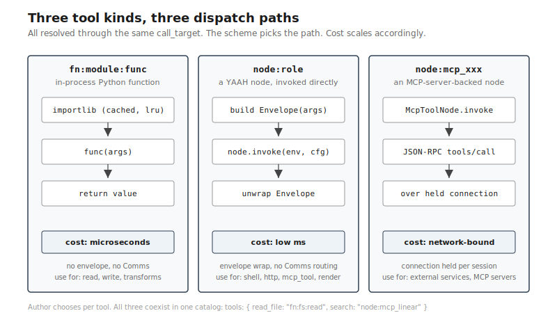

# Harness — tool use architecture

How YAAH lets an agent call tools. Short reference.

> **⚠ Design target, not current state.** None of the JSON snippets
> in this doc currently load via `yaah.runtime`. `agent_loop`,
> `mcp_tool`, `mcp_server`, and `fake_tool` are not registered in
> `src/yaah/build/builders.py`. The `stream()` provider protocol
> described below is the v2 target; today's code implements
> `ToolBackend.turn(messages, tools)`. The spike at
> `src/yaah/adapters/nodes/agent_loop_node.py` is wired by hand for
> examples, not by the builder registry. **Read this as the
> architecture we're building toward, not what runs today.** Tracking
> via [.notes/two-layer-proposal.md](../.notes/two-layer-proposal.md).

## The three layers



- **PIPELINE** — declarative DAG of stages (the orchestration YAAH has
  always done). Domain-free. One stage type is `agent_loop`; many
  stages don't need it.
- **AGENT_LOOP** — one stage = one bounded turn loop. The catalog of
  tools the agent can call is **author-declared** in the stage config.
  The agent has agency only within that fence (workers-not-citizens).
- **PROVIDER** — the replaceable seam. One verb,
  `stream(model, context, options)`, returns an async iterator of
  events carrying content blocks (`text | thinking | toolCall`). Any
  backend implementing this drives the loop: `claude_cli`, `litellm`,
  a future native Anthropic, the testing `fake_tool`, or a `pi_agent`
  wrapper for users who already run pi.

## One turn of the loop



The loop is small. Roughly:

```python
messages = [user_goal]
catalog = build_catalog(config.tools)         # once per stage
tool_specs = render_for_llm(catalog)          # cached
for turn in range(config.max_turns):
    events = provider.stream({system, messages, tool_specs})
    message = assemble(events)                # text + tool_calls
    if message.stop_reason != "tool_use":
        return message                        # done
    messages.append(message)
    results = await dispatch_all(message.tool_calls, catalog)
    messages.append({"role": "tool", "results": results})
```

Parallel by default (`asyncio.gather`); sequential when any tool in
the batch declares `execution_mode: "sequential"`. Tool errors flow
back as observations (`is_error: true`); only loop-internal errors
crash the stage.

## Three tool kinds, one dispatch mechanism



All tools resolve through the existing `call_target` resolver in
[`src/yaah/external_call.py`](../src/yaah/external_call.py). The
scheme picks the path:

| Scheme | Cost | Use for |
|---|---|---|
| `fn:module:func` | microseconds (cached import + call) | file ops, parsers, pure transforms |
| `node:role` | low ms (envelope wrap + node invoke) | shell, http, render, mcp_tool |
| MCP | network-bound (JSON-RPC over held connection) | external services |

**MCP is not a new scheme.** An MCP-backed tool is a `node` of type
`mcp_tool`, configured with a server reference (a provider in root
config) and a tool name. The MCP client adapter holds one connection
per server, shared across nodes. The agent loop never speaks MCP
directly — it dispatches `node:mcp_xxx` like any other node.

This preserves the project's stated position
([`external_call.py:15`](../src/yaah/external_call.py)): MCP is
model-initiated agent config, not engine surface.

## How to add a tool

A `fn:` tool — the simplest case:

```python
# my_tools.py
async def read_status(args):
    return "ok"
```

```json
{
  "loop_stage": {
    "type": "agent_loop",
    "backend": "claude_cli",
    "system_prompt": "file:agent",
    "tools": {
      "read_status": {
        "dispatch": "fn:my_tools:read_status",
        "description": "Check whether the system is OK.",
        "input_schema": {"type": "object", "properties": {}}
      }
    },
    "max_turns": 5
  }
}
```

A `node:` tool — for tools that should be reusable as pipeline stages:

```json
{
  "loop_stage": {
    "type": "agent_loop",
    "tools": {
      "fetch_url": {"dispatch": "node:http_fetcher"}
    }
  },
  "http_fetcher": {"type": "http", "url": "{url}"}
}
```

An MCP tool — configure the server in root config, declare the tool:

```json
{
  "providers": {
    "linear": {"type": "mcp_server", "transport": "stdio",
                "command": ["npx", "@linear/mcp-server"]}
  },
  "nodes": {
    "create_issue": {"type": "mcp_tool", "server": "linear", "tool": "create_issue"},
    "loop_stage": {
      "type": "agent_loop",
      "tools": {"create_issue": {"dispatch": "node:create_issue"}}
    }
  }
}
```

`description` and `input_schema` for MCP tools come from the server's
`tools/list` response, cached at stage start.

## Replaceability — adding a backend

Any class implementing `ApiProvider.stream(context, model=None, **opts)`
becomes a usable backend. The protocol lives in
[`src/yaah/agents/model_backend.py`](../src/yaah/agents/model_backend.py).
Existing backends:

- `claude_cli` — shells to `claude -p`; returns one big text_delta.
  v2 will use `--output-format stream-json` for per-token events.
- `litellm` — wraps the multi-provider library; translates litellm
  chunks to the unified event stream.
- `fake_tool` — scripted turn responses; for testing.
- `pi_agent` (planned) — invokes pi's CLI/SDK; for users who want pi
  as the agentic worker behind a YAAH stage.

Registration is config-time only — add an entry to your root config's
`providers` map; no engine change.

## Performance targets

The following are **design targets**, not measurements. A benchmark
suite proving them is part of the implementation plan, not shipped.

- Tool dispatch overhead target: **< 200 µs** for `fn:` tools (after
  `lru_cache` on `import_callable` lands; `external_call.call_target`
  is already direct-dispatch).
- Tool catalog: build once per stage `invoke()`, never per turn.
- MCP servers: one connection per server, held for runtime lifetime
  (or per-run if configured).
- Parallel tool calls in one turn: dispatched concurrently via
  `asyncio.gather` unless any tool in the batch is `sequential`.

## Where the code lives

| Concern | File |
|---|---|
| Loop primitive | `src/yaah/adapters/nodes/agent_loop_node.py` |
| Provider protocol | `src/yaah/agents/model_backend.py` |
| Tool resolver | `src/yaah/external_call.py` (`call_target`) |
| MCP adapter | `src/yaah/adapters/nodes/mcp_tool_node.py` *(planned)* |
| Backend implementations | `src/yaah/adapters/backends/` |
| Build registry (wires `agent_loop`) | `src/yaah/build/builders.py` *(pending)* |

## Related

- [Architecture overview](architecture.md)
- [Why YAAH](why-yaah.md) — positioning
- [Archetypes](archetypes.md) — the five pipeline shapes
- [ADR-0001](decisions/0001-three-concepts.md) — three concepts (`envelope`, `node`, `comms`)
- [ADR-0004](decisions/0004-parse-by-default.md) — parse-by-default
