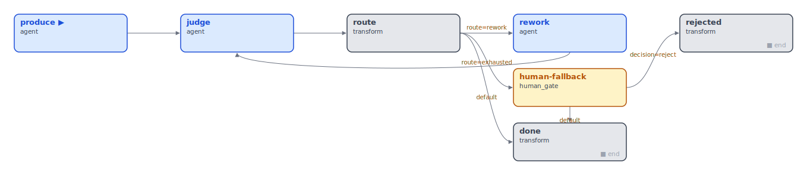
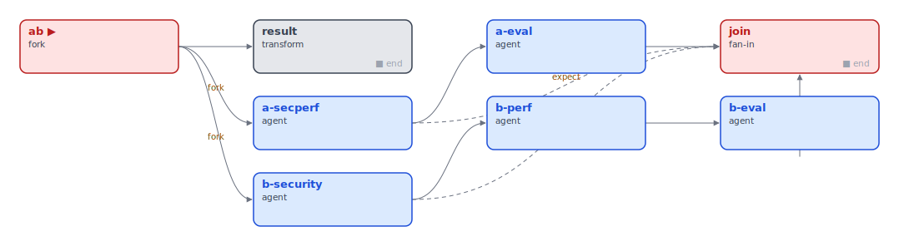

# Why YAAH — what it is for, and when to reach for it

YAAH is a **config-defined orchestration engine for agentic workflows**. The
workflow's *shape* — its stages, the branches between them, the parallel forks,
the loops back — is data (JSON + `_extends` overlays), not code. That single
choice is where every differentiator below comes from.

This is a positioning document, written honestly: YAAH is not always the answer,
and the "when NOT" section is as load-bearing as the "when". If your workflow is
a fixed, gateless, linear batch, you do not need YAAH (or any framework) — a
disciplined `asyncio` loop is the right tool. YAAH earns its keep the moment the
*shape itself* needs to vary, decide, or repeat.

---

## Three layers: core, extension, application

Everything in YAAH lives in exactly one of three layers, and the boundary is
strict — it's the same line along which the engine is **published** (core +
extensions) versus **kept private to a host project** (application).

| Layer | What it is | Where it lives | Rule |
|---|---|---|---|
| **CORE (engine)** | The domain-free kernel + ports: `Envelope`/`Node`/`Comms`, the harness (graph drive, branch/fork/fanin, gates, baton), build/runtime/validate, the **port** + zero-config default for each pluggable layer | `yaah/src/yaah/{core,harness,comms,agents,nodes,build,trace,store}/`, `runtime*.py`, `validate.py`, and the in-package `prompts/ data/ mcp/` ports | **Knows no domain.** No stage names, tenant fields, test runners, or app words. If you can name a host project from engine code, it's a bug. |
| **EXTENSION (adapter)** | The swap-in implementations that bind a port to an outside system | `yaah/src/yaah/adapters/{transports,backends,prompts,data,mcp,stores,trace}/` (NATS, `claude`/LiteLLM, file/HTTP/Langfuse/MLflow, git, file store) | Imports the engine, **never the reverse**. Adding one = a `routing_*` entry + a `file_*`/`http_*` adapter. Still domain-free. |
| **APPLICATION** | A specific pipeline built *on* the engine: its graph configs, prompts, deterministic transforms, report renderers | the app — its pipeline config, `transforms.py`, `prompts/*.md`, `render_*.py`, and templates like `judge-gate.json` / specializations like `spec-judge.json` | Owns all domain knowledge (specs, RED/GREEN, risks). Host-specific facts (repo paths, test commands) go one level further out, in a `<project>.project.json` overlay. |

Dependencies point **down only**: application → extension → core. The published
`yaah` package is **core + extensions**; the application
stays with its host project. Within the application layer there's a further split
the `_extends` mechanism makes explicit: a **generic template** (`judge-gate.json`
— portable, no domain words) versus a **domain specialization** (`spec-judge.json`
— overlays the real spec prompts/models onto it).

---

## What's awkward elsewhere and natural here

The first three are designed-in; the fourth (operator-agnostic control) fell out
of the design rather than being built — which is the strongest kind.

### 1. Run-time branching — a verifier routes the envelope

A stage can decide, at run time, **where the next message goes** — including
*backward*. A cold-reading judge emits a decision; a `branch` sends the one
envelope one of N ways. "Return to sender with added info" — re-run a weak spec on
a stronger model, carrying the judge's concerns — is a first-class shape, and the
loop is **bounded in one place** so it always terminates (rework N times, then
escalate to a human gate).



*This diagram is the real `judge-gate.json` config, rendered. The back-edge
(`rework → judge`) is the loop; `route` is the branch; `human-fallback` is the
bounded-exhaustion exit.* A flag (`if rerun_on_opus:`) cannot express this — only
a routing decision over a live result can send work backward with context.

### 2. Configuration-time A/B and variants — topology, not a re-run

A/B is not "run the script twice and diff the logs." It is a **fork in the graph**:
two arms run **concurrently on the same input**, a fan-in **reduces** them
(recall, cost, what B missed), and both share one trace format — so the comparison
is paired and apples-to-apples.



And the variant *itself* is config. A different model, a different prompt, a
skipped stage is an `_extends` overlay — change behaviour without touching code or
redeploying:

```jsonc
// spec-judge.json — a SPECIALIZATION of judge-gate.json
{ "_extends": "judge-gate.json",
  "nodes": {
    "role:produce": { "prompt": "file:spec",        "model": "claude:sonnet" },
    "role:judge":   { "prompt": "file:verify-spec",  "model": "claude:haiku"  },
    "role:rework":  { "prompt": "file:spec",         "model": "claude:opus"   }  // the escalation
  } }
```

The whole graph + bounded loop is inherited; the overlay swaps only prompts and
models. Your experiment config *is* the reproducible unit — the thing you log,
diff, and review — instead of a code branch you have to deploy.

### 3. Loops that terminate, and human gates that survive

Cycles are allowed (`branch` can target an earlier stage), but the engine makes
the bound explicit (the judge-gate counter) so "verify → rework → verify" can't
spin forever. And human gates are **durable**: a run parks at a gate, its state
persists to disk, and another process — or the same one after a restart — resumes
it. The factory's merge gate ("review the result + the changed code, approve?") is
this: the pipeline stops, a human decides, the run continues or halts.

### 4. An operator-agnostic control surface — a human *or* an AI can drive a run

The engine has **no notion of who the operator is.** A gate is a suspend point
plus a decision *envelope*; monitoring is a *subscription* to the trace subject.
Nothing assumes a human. So the same primitives let an AI assistant **drive** a run:

- **Monitor** — subscribe to the `trace` subject (stage progress, errored nodes,
  parked gates, cost). No engine change; a UI or an AI co-pilot just listens.
- **Steer** — deliver a resume decision to a parked gate, choosing among the gate's
  *declared* routes (`revise→grill`, approve, reject). The AI picks; it doesn't
  invent edges.
- **Change the next run** — edit the config / add an `_extends` overlay. Because the
  topology is data, "make the pipeline do X next time" is a config edit an assistant
  can make.

Two deliberate boundaries keep this clean rather than chaotic:

- **No live topology mutation.** Reroute *within* a run only via a declared decision
  (the `revise` route already exists); a genuinely new route is a config edit → next
  run. The graph is fixed at build time on purpose — that's what keeps runs
  replayable and deterministic.
- **Authorization is a cloud concern, not a local one.** Locally (single operator),
  there is nothing to authorize — the AI co-pilot works today, authz-free. In a
  **shared/cloud** deployment the control surface is gated by per-principal
  authorization ("which gates/clears may this principal touch"), which rides the
  distribution layer (NATS subject ACLs / authz-scoped state) — added when a shared
  deployment exists, not before. In-process full control is the zero-infra default;
  authz is the swappable distribution concern.

---

## YAAH + AI: the workflow as something the AI operates ON

A fixed harness treats an AI as a node — one job inside a shape someone else
froze. Because YAAH's topology is data and its control surface is
operator-agnostic, an AI can also be the **author, optimizer, router, monitor,
and healer** of the workflow itself. `_extends` is what makes that trustable:
every AI change is an *overlay* — the base config stays intact, the change is a
reviewable diff, and reverting is deleting a file. The AI adds layers; a human
promotes winners into the base. The layering IS the governance model.

The uses, strongest first (maturity tagged honestly):

1. **Closed-loop variant optimization** *(near-term — the pieces exist)*: the AI
   reads the A/B fork's reduce (recall, cost, what B missed) and emits the next
   overlay ("haiku matches sonnet on risk-3 at 1/5 cost — swap it"). The human
   promotes winners. AI as search policy; YAAH as the experiment substrate.
2. **AI gate-triage** *(near-term)*: at a human gate the AI pre-reviews the packet
   and auto-clears low-risk runs, escalating only the ones worth human eyes —
   the two-gate model scaled by tiered trust. Same primitives; the gate doesn't
   care who decides.
3. **Adaptive per-item topology** *(the judge-gate is the embryo)*: an AI judge
   routes each input among the graph's DECLARED options by difficulty — cheap
   single pass for the clear-cut, forked comparison for the ambiguous.
4. **Natural-language front-end** *(the authoring skills are the embryo)*: "re-run
   last week's eval on the new model, failed cases only" → the AI composes
   overlay + input and launches. `validate.py` gives it loud structural feedback;
   the SVG renderer shows the human the shape.
5. **Self-healing / silent-death detection** *(needs the R7 trace consumer)*: the
   AI watches trace spans for the "0 findings looks clean but the producer died"
   class, publishes a clear or proposes a fix overlay.
6. **Experiment search** *(speculative)*: budget-bounded search over the
   model × prompt × context variant space, scored by the recall machinery.

### The pitfalls — and where the safeguards live

An AI improving the pipeline on the fly is a **theory to test, not a claim** —
and the failure modes are predictable enough to guard *before* testing it. The
safeguard architecture is the factory's own trust model applied at the meta
level: deterministic checks, then cold-reading sceptics, then a human gate.

| Pitfall | Safeguard |
|---|---|
| **Safety-rail erosion** — the AI "improves" by removing what slows it down: a sceptic dropped, a loop bound raised, a `reject` route deleted, `force:true`, widened tools | **Overlay lint (deterministic)**: diff overlay vs base; AI may change LEAF VALUES (model, prompt, bounds within limits) — topology/gate/safety-property changes require human promotion. Provenance (`_authored_by`) on every AI overlay. |
| **Metric gaming** — the number moves for a bad reason (weak judge, saturated eval) | Score on **held-out fixtures** the proposer never sees; a sceptic asks "did this genuinely improve?" |
| **Meta self-correction loop** — the proposer judging its own proposal | The factory's core rule, one level up: **proposer ≠ evaluator ≠ promoter (human)**. The meta-pipeline is itself a judge-gate: produce = overlay proposal, judge = config-sceptic, bounded rework, human fallback. |
| **Overlay sprawl** — the monster-config tax, automated | Overlay lifecycle: experiment → promoted or deleted; an orphan/age linter (the manual weeding, mechanized). |
| **Compounding unreviewability** — overlays on overlays | Depth-bound AI-authored `_extends` chains; flatten-and-review periodically. |

### What the experiments showed (2026-06-11/12)

The theory was tested deliberately, three times, with the safeguard layers
live: the deterministic lint (`yaah/src/yaah/overlay_lint.py`,
`yaah <overlay> --lint-overlay`), the config-sceptic meta-pipeline (the
judge-gate template specialized so lint failures and sceptic concerns share one
bounded rework loop and a dirty overlay never reaches the judge), a
deterministic dev-set acceptance gate, and a once-only held-out verdict.

1. **Synthetic task, mid-tier workers, one-shot proposer:** the AI's overlay
   passed every gate and genuinely transferred — held-out precision 0.35→0.67
   at unchanged recall. Improvement-via-config is real when the executor is
   adequate and the metric clean.
2. **Real production bugs, weak (haiku) workers, iterating proposers — run
   twice with two different frontier models:** both proposers won the dev set
   and **collapsed on held-out** (0.50 → 0.33 and 0.27), both by inventing
   focus devices (pattern checklists, output caps) that a small dev set rewards
   and unseen data punishes. The failure replicated across proposer models —
   it is structural (executor capacity + tiny dev set + unreplicated evals),
   not a model-IQ gap.

What this licenses: **AI as operator is demonstrated** — the full loop
(propose → gate → evaluate → iterate → stop → record) ran unattended across
~40 scored pipeline runs with zero bad promotions; the gates caught everything,
in depth (lint mechanically, sceptic on intent, dev-gate 5/7, held-out the 2
that slipped — and the one device that fooled the sceptic became a sceptic rule
the same day). **AI as optimizer is conditional** — it worked exactly where
executor strength, metric cleanliness, and data volume permitted, and failed
honestly where they didn't. The practical sweet spots that fall out: unattended
pipeline operation with human gate packets, continuous regression evaluation of
prompts/models against fixture archives, and cost-tier experiments whose
trustworthy answer may be "no". The distilled craft (what prompt changes weak
executors tolerate; tighter scope must be bought with more agents) lives on as
proposer-facing operating instructions — every failure left the system smarter.

---

## When to use YAAH

Reach for it when one or more of these is true:

- **A verifier/judge decides where work goes next** — route, loop back with notes,
  or escalate to a human. (The flag matrix can't represent this; a graph can.)
- **You run A/B or variant experiments** and want them as *config* (forks +
  `_extends` overlays), reviewable and reproducible, not code forks you redeploy.
- **You need durable human-in-the-loop gates** — suspend/resume, cross-process,
  surviving a restart.
- **The workflow shape varies per-execution** (per-experiment, per-tenant, per-task)
  rather than per-release. This is the precise trigger: when shape changes faster
  than your deploy cadence, config-defined topology stops being overhead and starts
  paying for itself.
- **You want the topology to be reviewable** — diff a JSON graph, not a diff of
  control-flow buried in a 300-line function.

## When NOT to use YAAH

Be honest about these — adopting an engine you don't need is its own cost:

- **A fixed, gateless, linear or fan-out-only batch.** "For each item, call the
  model, collect results" needs `asyncio.gather` + a semaphore + a tracing lib, not
  a workflow engine. The differentiated half of YAAH (gates, routing, loops) sits
  idle.
- **You're deep in an ecosystem you won't leave** (LangChain, Semantic Kernel,
  Azure ML). YAAH is an orchestration layer; if your agent framework already
  orchestrates well enough, a second one is friction. Often the right move is to
  **compose, not replace** — let YAAH own the graph and keep the platform (e.g. an
  MLflow trace sink, SK agents as nodes).
- **You need a hosted UI, dataset versioning, or a large integration catalogue
  today.** YAAH is minimal-first (~13k lines, zero-dependency core, file-based, no hosted anything). It
  composes with platforms that provide those; it does not replace them.

---

## Versus other orchestration protocols

Honest comparison — every tool here is good; the question is fit.

| Capability | YAAH | LangGraph | Temporal | PromptFlow |
|---|---|---|---|---|
| Where the graph is **defined** | **config (JSON + `_extends`)** | Python (`StateGraph`) | Python/Go code | YAML + Python tools |
| Change shape **without redeploy** | **yes — overlay/edit config** | no — code change | no — code change | partial (flow YAML) |
| A/B / variants | **fork + overlay, first-class** | code branches | code | **dataset variants + UI** |
| Verifier routes the envelope (incl. **backward**) | **branch on a payload key** | conditional edges (Python fns) | signals/code | limited |
| Durable human gates | **suspend/resume, cross-process** | interrupts + checkpointer | signals (heavy) | n/a |
| Stage isolation | **enforced (fresh agent, named carry)** | shared state object | activity boundaries | per-node |
| Durability / replay | swappable Store (minimal) | checkpointer | **best-in-class** | run history |
| Ecosystem / UI / integrations | minimal (compose with others) | **large (LangChain/LangSmith)** | large | **Azure-native UI** |
| Engine size / lock-in | **~13k lines, zero-dep core, domain-free** | framework | platform | platform |

**Where YAAH clearly wins**

- **Config-time topology.** The graph, its branches, forks, and loops are data.
  A/B, model swaps, skip-conditions, per-tenant shape are `_extends` overlays —
  reviewable as a config diff, changeable without a deploy. In LangGraph/Temporal
  the topology is code; a variant is a code change.
- **The verifier-routes-the-envelope pattern as a reusable, bounded template.**
  LangGraph has conditional edges, but the routing lives in Python functions and
  the loop bound is hand-rolled per graph. Here the judge-gate is one `_extends`
  template with the bound built in, specialized by overlay.
- **Durable human gates by default, with clean stage boundaries.** Suspend/resume
  is cross-process out of the box, and YAAH deliberately has **no mid-node
  interrupt** — a gate is always a stage boundary, which keeps runs replayable and
  reasoning isolated. (LangGraph's mid-node interrupt is more flexible but breaks
  the clean boundary.)
- **Domain-free engine + minimal footprint.** No framework lock-in; the same
  `Tool` spec drives both function-calling and prompt-manifest backends.

**Where the others win — use them (or compose)**

- **Temporal** for hard durability/replay guarantees at scale — it's purpose-built;
  YAAH's Store is deliberately minimal.
- **LangGraph/LangChain** for ecosystem breadth, streaming, and LangSmith — if
  you're already there, the integration cost of leaving is real.
- **PromptFlow / Azure ML** for hosted experiment tracking, dataset versioning, and
  the variant-comparison UI. YAAH's answer here is to **emit into** them (a trace
  sink), not to rebuild them.

---

## The one-line version

Use YAAH when the **shape of the work** — its decisions, its parallel arms, its
loops, its human checkpoints — needs to be **declared, varied, and reviewed as
configuration** rather than compiled into code. If the shape is fixed and simple,
don't; if it must branch, fork, loop, or pause for a human, this is what it's for.
